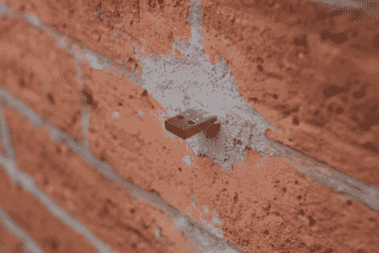

# 这是一个点对点文件共享网络

> 原文：<https://hackaday.com/2010/10/30/this-is-a-peer-to-peer-filesharing-network/>

【阿拉姆·巴索尔】正在[建立他自己的文件共享网络](http://datenform.de/blog/dead-drops-preview/)来打击那些想要控制你自由的肥猫。他在整个纽约市增加了匿名免费使用的文件缓存设备(目前有五个，但还会有更多)。上传你想要的，下载你想要的。他们完全离线，这意味着监控谁在做什么变得更加困难，很可能需要法官的授权(我们显然不是法律专家，你的里程数可能会有所不同)。

至于那些肯定会指出恶意 USB 设备的危险的评论；我们认为每个人都知道，当连接到一个从砖墙上伸出来的 USB 插头时，他们正在承担一些风险。

[谢谢领口]