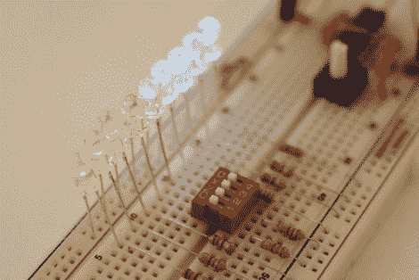

# 初学者概念:来自 Giz 的电子学基础

> 原文：<https://hackaday.com/2010/10/30/beginner-concepts-electronics-basics-from-the-giz/>

Gizmodo 大学开始营业。这个免费的教育系列旨在[传授电子理论的基础知识](http://gizmodo.com/5677024/gizmodo-university-volts-amps-and-ohms)。不需要先决知识，他们从基层开始。第一课？电阻！在那里，他们发布了关于分压器、串联/并联电路、欧姆定律以及如何计算 LED 的电阻值的内容。

这是一个获得基础知识的好方法，你需要像一个 EE 一样开始黑客。这些是我们假设你已经掌握的概念，如果你跟随[我们的 AVR 编程系列](http://hackaday.com/2010/10/23/avr-programming-introduction/)。我们正在努力完成第三部分，但离完成还有一段距离。你有时间做一个 GizU 复习，重读[我们最喜欢的电子理论书](http://www.amazon.com/There-Are-Electrons-Electronics-Earthlings/dp/0962781592)。