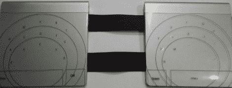

# 键盘概念使用魔法轨迹板

> 原文：<https://hackaday.com/2010/10/31/keyboard-concept-uses-magic-trackpad/>

这是[Sebastian]用两个苹果 Magic Trackpads 制作的键盘替代品。多点触摸设备是一个很好的平台，因为它们被设计成同时拾取几个事件。为了制作钥匙位置的原型，他使用了可打印的透明纸。他给你一种感觉，用手指沾一点透明的指甲油就能感觉到家在哪里。

一旦关键位置正好合适，他可以激光蚀刻这些焊盘。这本身应该会给人一点质感，并且不再需要指甲油，但我们仍然喜欢这种解决方案的独创性。该设备正在 Linux 下开发，通过一些内核黑客来处理设备。我们询问了源代码，[Sebastian]犹豫是否发布，因为他已经得到了很多内核恐慌。听起来好像一旦他清理了一些东西，他就会分享他的工作。

别忘了，有一个简单的方法可以去掉这些东西的电池。