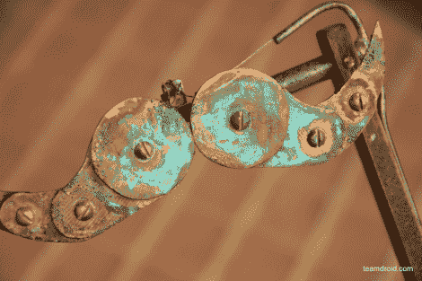

# 机械小胡子羡慕

> 原文：<https://hackaday.com/2010/10/31/mechanical-mustache-envy/>

虽然这个机械小胡子不是为万圣节服装制作的，但它看起来确实像万圣节服装的一部分。覆铜、黄铜、电缆和其他一些东西以类似于[基于张力的手](http://hackaday.com/2010/10/07/cheap-robotic-hand/)的方式组合在一起；然后戴上它，就像狂欢节面具一样。为了完成[约翰]追求的质朴的“老泰梅”外观，使用醋和盐溶液的蒸汽使铜失去光泽。完成的装配是[蒸汽朋克美味](http://hackaday.com/2010/03/01/steampunk-sequencer/)，但是我们为缺少蒸汽朋克眉毛来完成这个造型而难过(或者蒸汽朋克羊排，或者蒸汽朋克山羊胡子，或者……)

[via [Boing Boing](http://www.boingboing.net/2010/10/31/mechanical-mustache.html?utm_source=feedburner&utm_medium=feed&utm_campaign=Feed%3A+boingboing%2FiBag+%28Boing+Boing%29)