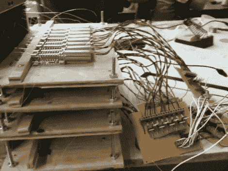

# 作为输入输出的打字机；让你玩 Zork

> 原文：<https://hackaday.com/2010/11/01/typewriter-as-io-lets-you-play-zork/>

好吧，对许多人来说，这台打字机在纸上而不是在 CRT 上播放 Zork 是这个黑客的迷人之处。但是我们喜欢将设备的按键作为输入和输出的实现。

电动打字机的每个键都配有一个螺线管(哇，工作量真大)。在上图中，你可以看到它们被安置在打字机后面的胶合板平台上，用一根单丝钓鱼线连接起来。这种灵活的连接意味着当*你*想要打字而不是驱动螺线管的 Arduino 时，螺线管没有不利影响。[张克帆·m·古伯曼]利用了这一点，为每个按键增加了一个电阻。当按下该键时，完成一个带有电阻器的电路，作为输入。通过这种方式，您可以用一张纸作为显示器来玩 Zork，为输入而打字，并看着打字机神奇地打出响应。休息之后再看。

<https://player.vimeo.com/video/16311288>

 
【via <a href="http://laughingsquid.com/automatypewriter-a-typewriter-that-can-play-zork/" target="_blank">笑鱿鱼</a>和<a href="http://blog.makezine.com/archive/2010/10/play_zork_on_an_arduino-controlled.html" target="_blank">闹</a>
 </body> </html>