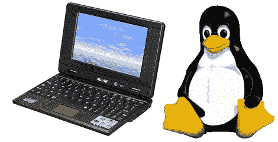

# 引导 Linux

> 原文：<https://hackaday.com/2010/11/01/augen-e-go-booting-linux/>

Augen E-Go 被宣传为 Windows CE 附带的上网本。经过一段时间的[硬件窥探](http://wtfmoogle.com/?p=1693)，它启动了 Linux 内核。他在主板上找到了一个 UART 连接器，并发现如果将 enable 引脚接地[，就可以在启动期间向设备发送 ARM 引导程序](http://wtfmoogle.com/?p=1700)。他过去黑掉 Didj 和探索者的经验帮助他认出了 Augen 中使用的处理器。这导致使用来自 Didj 的 zimage 来引导 Linux 内核。到目前为止，该过程因内核崩溃而停止，但这是因为他还没有为设备构建带有文件系统的映像。

如果 E-Go 最终能很好地与 Linux 兼容，[Moogle]可能已经找到了 Zipit 的合适替代品。

更新:看起来我们得到了上图(和下面的链接)中错误的版本。查看型号的[【谷歌】评论](http://hackaday.com/2010/11/01/augen-e-go-booting-linux/#comment-206336)。

【奥根图片来源:[Newegg.com](http://www.newegg.com/Product/Product.aspx?Item=N82E16834320001)