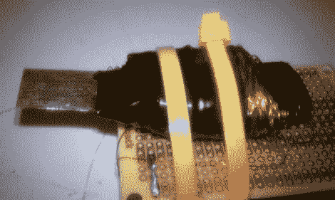

# 磁卡磁条欺骗器

> 原文：<https://hackaday.com/2010/11/02/magnetic-card-stripe-spoofer/>

这个组件的大杂烩能够伪造信用卡上的磁条。[Sk3tch]用包在漆包线磁线中的黑色金属垫片制作了一个电磁铁。当他绕线的时候[Sk3tch]将他的万用表连接到金属垫片和电线的一端，设置它来测试连续性。这样，如果他不小心刮坏了搪瓷涂层，把电线接到金属上，电表会发出声音和警报，他会立即知道短路的情况。Arduino 从这里接手，驱动线圈来模拟磁条的不同数据部分。

从他的原理图中，我们看到电磁铁直接连接到 Arduino 的两个引脚。我们没有研究代码，但似乎应该有一些电流限制，或使用晶体管来保护微控制器引脚(我们可能会错了)。

这个欺骗器的实现只需要几个部分就可以很快完成。卡数据必须写入代码，并闪存到 Arduino。如果你想知道一个功能更丰富的版本需要什么，看看这个有键盘的欺骗器可以随时改变数据。

[via [Lifehacker](http://lifehacker.com/5677465/diy-arduino-magstripe-emulator)