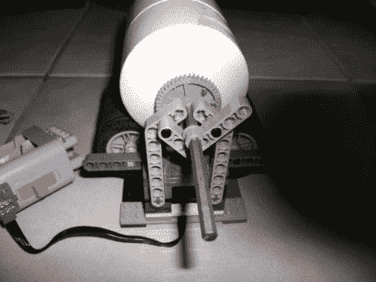

# 乐高球磨机

> 原文：<https://hackaday.com/2010/11/02/lego-ball-mill/>

这是一台球磨机,用于将材料提炼成细粉。[Jpoopdog]由两部分组成，一个底座和一个不倒翁室。底座本身是用乐高轮子作为滚轮建造的。NXT 套件中的电机和控制器用于驱动旋转，并通过编程不时地停止研磨机，以便原材料可以冷却下来。这很重要，因为这可以用来制造铝粉等物质，铝粉是一种有时用于烟火的爆炸性物质。我们不建议你自己生产炸药(或者[自己制造推进剂](http://hackaday.com/2010/09/28/homemade-solid-propellant-rocket-motors/)，但是如果这是你想要的，那么【Jpoopdog】确实内置了一个安全功能。这个由聚氯乙烯制成的容器有一个自动防故障装置来防止爆炸。在端盖上钻了一个洞，并用热胶堵住。在研磨材料开始过热的情况下，胶水会融化并减轻积聚的压力。