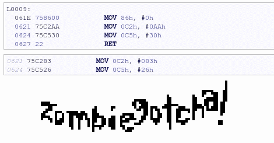

# 黑客入侵:IM-ME 二进制文件的反汇编和嗅探

> 原文：<https://hackaday.com/2010/11/02/hacking-a-hack-disassembly-and-sniffing-of-im-me-binary/>

挑出代码很有趣，但是当你谈论二进制代码时，它变得更加困难。[Joby Taffey]通过从僵尸游戏二进制文件中分解和嗅探数据，向[Travis Goodspeed]的黑客之一揭示了秘密。

我们昨天在[参观了【Travis 的】工作，在 IM](http://hackaday.com/2010/11/01/im-me-graphic-manipulation-using-sprites/)上使用精灵创建了一个游戏。他挑战读者从 iHex 二进制文件中提取 1 位精灵，这就是[Joby]开始的原因。他首先尝试使用总线盗版来嗅探 LCD 数据痕迹，但很快发现时钟信号太快，设备无法可靠地捕捉信号。在查看了来自其他 IM-ME 黑客的可用源代码后，[Joby]发现了 SPI 波特率是如何设置的，然后在[Travis']二进制反汇编中继续搜索。一旦找到，他就解决了将通信速度从 2.7 兆位/秒降低到 2400 兆位/秒所需的数学问题，并修改了二进制数据以适应这种变化。这种较慢的速度更符合总线盗版者的能力，并允许他在发送到 LCD 屏幕时转储精灵数据。

[谢谢特拉维斯]