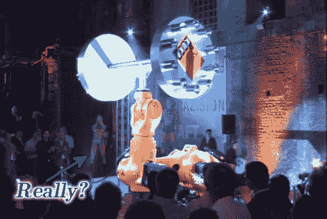

# 机器人二头肌弯曲伴随着太大的声势

> 原文：<https://hackaday.com/2010/11/02/robot-bicep-curl-accompanied-by-too-much-fanfare/>

所以这就是[世界上最强的机械臂](http://www.botjunkie.com/2010/11/02/worlds-strongest-robot-arm-can-now-chase-you-down/)。太好了…不，真的，那太好了。我们认为举起 1000 公斤的哑铃是向公众炫耀的好方法。但是随着强大的力量而来的是世界上最夸张的营销。嗯，也许不像[摇摇重量](http://en.wikipedia.org/wiki/Shake_Weight)那么糟糕，但也快了。在休息后的视频中，你会看到大量令人肾上腺素飙升的音乐，他们聘请了一名杂技演员来拉下一张纸。我们在上面的图片中指出了她。[Caleb]注意到他们似乎在人类动力学中设定了程序，使其像人类举起重物一样弹跳和拉紧。然后是造雾机。经典。我们也喜欢使用龙头灯([，我们在](http://hackaday.com/2010/06/22/morse-code-clock/)之前已经在这里看到过)来激活演示。

但现在我们有点忘乎所以了。顶部链接的文章涵盖了 arm 的新发展；一个可以移动它的电动底座。看起来这个使用麦克纳姆轮的底座只是滑到机器人的固定框架下，并提升到足够让它四处移动。

 <https://www.youtube.com/embed/LcZJA3XyVjQ?version=3&rel=1&showsearch=0&showinfo=1&iv_load_policy=1&fs=1&hl=en-US&autohide=2&wmode=transparent>

 </body> </html>