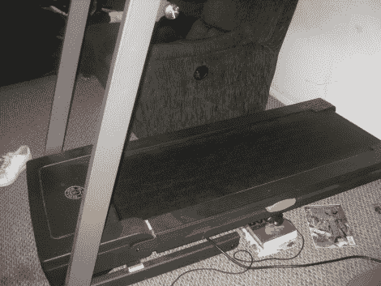

# 快速简单的街景跑步机

> 原文：<https://hackaday.com/2010/11/04/quick-and-easy-street-view-treadmill/>

这是[托马斯·克劳萨的] [谷歌街景功能跑步机](http://wolfebaine.blogspot.com/2010/11/google-street-view-treadmill-made-easy.html)。他指出，大多数[街景黑客](http://hackaday.com/2010/10/29/exercise-along-to-google-street-view/)使用旋转运动的测量来与计算机交互。他尊重这一点，但不想花时间让它在跑步机上工作。相反，他使用了一个支撑在跑步机框架下的一本书上的隐形开关，但只要你知道如何将它连接到计算机，任何开关都可以使用。当你站在跑步机上时，框架会弯曲，几乎会点击按钮，但当你开始跑步时，它会移动其余的路径并关闭开关。从那里一个[自动热键](http://www.autohotkey.com/)脚本被用来推进街景。