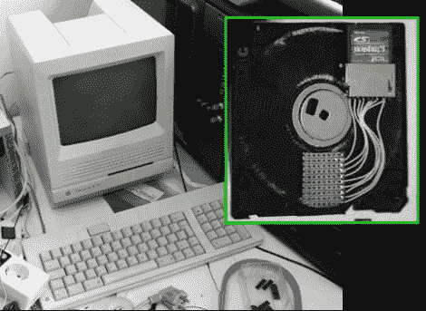

# Mac SE 重生为服务器和 Mac 模拟器

> 原文：<https://hackaday.com/2010/11/04/mac-se-reborn-as-a-server-and-mac-emulator/>

[Sprite_TM]通过使用 Dockstar 和 ARM 处理器复活 Mac SE，创造了一个惊人的黑客技术。由于故障备用电池的腐蚀性，复古硬件的主板很差。他一直想和希捷 Dockstar 的[做点什么，并决定让它在 Mac 上找到一个好归宿。但是一台死机器装着一个无头服务器有什么意思呢？为了增加乐趣，他加入了运行 Mac 模拟器的 ARM 处理器，以及使屏幕、键盘和外围设备工作的所有部件。当 Mac 关闭时，Dockstar 仍然作为服务器运行。](http://hackaday.com/2010/10/04/more-openwrt-image-building-for-the-dockstar/)

但是最好的部分之一是软驱。它仍然需要软盘，但里面已经没有磁介质了。相反，他增加了一个 SD 卡插槽，并在读取头的空间增加了一些原型板。驱动器本身已经为一些弹簧针移植了读取头(嘿，[我们今天早些时候看到了这些](http://hackaday.com/2010/11/04/test-beds-and-jigs-with-pogo-pins/))。当你插入软盘时，弹簧针上升并接触到原型板，将 SD 卡连接到一个微型控制器。

这个项目进行得太多了，我们无法在这里面面俱到。在[Sprite _ TM]的帖子中，诸如化学清洗以恢复经典外壳的原始颜色，以及构建转换器以使外围设备兼容 USB 等事情只是等待您的一些乐趣。他还拍摄了一个演示视频，我们在休息后嵌入了这个视频。

[https://www.youtube.com/embed/nvWY7wD8XEg?version=3&rel=1&showsearch=0&showinfo=1&iv_load_policy=1&fs=1&hl=en-US&autohide=2&wmode=transparent](https://www.youtube.com/embed/nvWY7wD8XEg?version=3&rel=1&showsearch=0&showinfo=1&iv_load_policy=1&fs=1&hl=en-US&autohide=2&wmode=transparent)