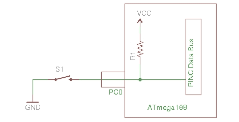

# AVR 编程 04:写代码等。

> 原文：<https://hackaday.com/2010/11/19/avr-programming-04-writing-code-etc/>

欢迎回到这个系列的第四部分，也是最后一部分。前三部分应该足够让你起步了，但是多学几个例子也无妨。这也是讨论这些小芯片能做的其他事情的好时机。休息之后请和我一起:

*   扩展示例代码，向我们的简单程序添加特性，同时我要求您自己编写代码。
*   讨论 AVR 保险丝位，如何使用它们，以及需要注意的事项
*   接触一些你会在这些芯片中遇到的外设

作为本系列的一大亮点，我用最后一部分中的示例硬件制作了一个自行车尾灯。希望这能激发你创造更聪明的东西。

**系列路线图:**

*   [AVR 编程 01:简介](http://hackaday.com/2010/10/23/avr-programming-introduction/ "Permanent Link to AVR Programming 01: Introduction")
*   [AVR 编程 02:硬件](http://hackaday.com/2010/10/25/avr-programming-02-the-hardware/ "Permanent Link to AVR Programming 02: The Hardware")
*   [AVR 编程 03:读取和编译代码](http://hackaday.com/2010/11/05/avr-programming-03-reading-and-compiling-code/ "Permanent Link to AVR Programming 03: Reading and compiling code")
*   [AVR 编程 04:写代码](http://hackaday.com/2010/11/19/avr-programming-04-writing-code-etc/)

## 添加到示例硬件

我在本教程的最后两部分中使用的示例代码有点无聊。它使一个 LED 以大约 1 Hz 的频率闪烁。该 LED 连接到 PD0 的引脚，因此我们先将一个 LED 和一个电阻添加到其余的端口 D 引脚，总共 8 个 LED。我们还应该谈谈输入，所以让我们在 PC0 上添加一个开关。这是展示我们变化的示意图:

**** 

我把原来的 LED 移到了试验板右侧的一些空地上。我将阴极连接到底部的接地轨，用一个电阻跨接沟槽，并将一个跳线从该电阻连接到微控制器的 D 端口引脚。我按照从右到左的升序对 led 进行了组织，以便在编写代码时能够轻松地处理它们:

如果你知道你的[电阻颜色代码](http://www.google.com/images?hl=en&q=resistor+color+code&um=1&ie=UTF-8&source=univ&ei=WOziTOSAB8Hsngfqr7jODg&sa=X&oi=image_result_group&ct=title&resnum=2&ved=0CDUQsAQwAQ&biw=1024&bih=441)，你会注意到我使用的棕-绿-红电阻是 1.5 千欧，扼制了 led 的微小电流。嗯，我用的是超亮的发光二极管，这些电阻是我最先拿出来的。它们可以很好地用于原型制作，但是应该在成品上用正确计算的值来代替。

接下来，我挂上一个按钮。微控制器上的数字输入值需要为 0V 或 VCC(本例中输入电压为 5V)。如果他们没有一个明确的值，他们被称为“浮动”，这可能导致错误的按钮读数和其他不愉快的事情发生。我们需要设置硬件，使其始终保持 0V 或 5V 的值。事实证明这很简单。通过将开关从引脚连接到地，并将一个电阻从引脚连接到 VCC(称为上拉电阻)，将始终有非常小的 5V 电流流入引脚，除非通过按下按钮创建了不受限制的接地路径。我们甚至不需要自己的电阻，因为微控制器内部有一个我们可以利用的电阻。这张原理图显示了这种连接以及内部上拉电阻的情况:

这个描述有点拗口，但我们真正做的是在 PC0 和地之间放置一个按钮。23 号针是 ATmega168 上的 PC0，紧挨着它的针(22 号针)是 GND。我相应地连接了一个开关。在下图中，请注意 22 号针通过跳线连接到其上方的接地轨，但被按钮上的黑线遮住了:

最后，我想连接芯片进行系统内编程。我喜欢用我自己创造的插线板来做这件事。这让我可以使用 10 针 IDC 电缆轻松连接到我的编程器:

就是这样。我计划用几个不同的固件例子来使用这个硬件，所以仔细检查你的布线，然后开始写代码。

## 编写代码

是时候练习编写自己的代码了。我已经想出了四个固件例子，从“Hello World”到“该死的滑头”。我将简要地讨论它们中的每一个，但是在这个过程中，你应该试着写你自己的代码，使用我的例子作为…例子。学习编码最好的方法是写一小部分代码，让编译器吼你搞砸了，然后想办法修复。

**闪烁所有 8 个(8 个 led_1hz)**

 <https://www.youtube.com/embed/ssBfFUoLjFI?version=3&rel=1&showsearch=0&showinfo=1&iv_load_policy=1&fs=1&hl=en-US&autohide=2&wmode=transparent>

 
首先，<em> <strong>你</strong> </em>能让第二部分中的<a href="https://github.com/Hack-a-Day/had_AVRtut_2" target="_blank">示例代码闪烁所有 8 个 led 而不是一个吗？</a>
 
要做到这一点，你只需要改变原来的两件事。首先，在设置输入/输出时，使端口 D 上的所有引脚都输出，然后将它们全部打开。第二，当切换中断服务程序中的位时，使用影响所有八位的位掩码。
 
<a href="https://github.com/Hack-a-Day/had_AVRtut_4" target="_blank">该系列的这一部分</a>的源包包括这一变更。抓住它的一个副本，看看 8led_1hz 代码。你会发现这些变化:
 <pre class="brush: cpp; title: ; wrap-lines: false; notranslate" title=""> DDRD |= 0xFF; //Set PortD pins as an outputs&#13; PORTD |= 0xFF; //Set PortD pins high to turn on LEDs&#13; </pre> <pre class="brush: cpp; title: ; wrap-lines: false; notranslate" title=""> PORTD ^= 0xFF; //Use xor to toggle the LEDs</pre> 
如您所见，这两部分代码都使用 0xFF 作为位掩码。这是一个包含全 1 的字节，它将操作我们应用它的寄存器上的每个引脚。在我用这个稍微移动一下之前:
 <pre style="padding-left:30px;">'1&lt;&lt;0'</pre> 
它产生 0x01 的位屏蔽，保护高 7 位在寄存器操作期间不被改变。
 
<strong>让 led 做一些有趣的事情(m168_led_effects) </strong>
 <iframe class="youtube-player" width="800" height="480" src="https://www.youtube.com/embed/d-wyP7iYaWg?version=3&amp;rel=1&amp;showsearch=0&amp;showinfo=1&amp;iv_load_policy=1&amp;fs=1&amp;hl=en-US&amp;autohide=2&amp;wmode=transparent" allowfullscreen="true" style="border:0;" sandbox="allow-scripts allow-same-origin allow-popups allow-presentation"/> 
现在我要在 C 代码难度上前进一大步。但是我要求你自己开发三种不同类型的 LED 效果:
 <ul> <li>以每秒 1 位的速度递增计数的二进制计数器</li> <li>每隔一个 LED 交替点亮的闪光灯</li> <li><a href="http://www.youtube.com/watch?v=NPAqGgYpb4A" target="_blank">拉森扫描仪</a>(简单的一种，不需要使用 PWM)</li> </ul> 
您将在 m168_led_effects 目录中找到我的示例代码。下面是我在代码中使用的一些新东西:
 
<strong>定义:</strong>我使用了通用设置和 I/O 引脚、端口和方向寄存器的定义。这些是常量，编译器会用适当的值替换它们，但是它们会使您的工作更容易。如果你进入一个项目的大部分，并意识到你需要改变一些硬件，这将使它变得简单。需要从 D 口换到 C 口？没问题，改变#define，剩下的代码仍然可以工作
 
<strong> Delay: </strong> AVR libc 有一个很好的 Delay 实用程序，叫做 delay.h，你可以看到我已经把它包含在源文件的顶部，还写了一个函数叫做 delay_ms()。这是一种相当准确的记录时间流逝的方法。使用这种方法的缺点是，当处理器可以做其他事情时，您实际上是在浪费时间。尽管如此，它很简单，如果你是微控制器的新手，你可能会发现自己一开始经常使用它。
 
在这个版本的代码中值得注意的是，我使用函数来减少 MAIN 的复杂性。我喜欢尽可能这样做，以使程序流更具可读性。如果你使用描述性的函数名，其他人很容易通过 main 看到固件是如何工作的。这也是为什么我经常注释我的代码。不仅仅是为了其他人，也是为了当我以后回过头来想不起来我最初写这个程序要做什么的时候，我可以快速地阅读它。
 
在我们继续之前，我先简要介绍一下我是如何实现这三个目标的:
 <ul> <li>当显示 1Hz 的二进制计数器时，我简单地启动定时器 2，就像我在教程的第 2 部分中为闪烁的 LED 所做的一样。每次它触发时，我不切换引脚，而是将整个端口设置为一个 8 位变量值，同时递增它。++binary_counter 在设置端口 d 之前递增该值，使用关键字“volatile”使该值成为全局变量是至关重要的，因为 ISR 和主循环都会更改该值。如果你不把它变成 volatile，编译器可能会以一种扰乱或破坏预期功能的方式优化代码。</li> <li>创建一个交替闪光器与切换单个 LED 非常相似。我通过实例化一个每隔一位为 1 的变量来设置效果。当对该值使用异或运算符(XOR)时，所有的位都将翻转。我可以设置一个比 1 Hz 中断延迟更短的中断来解决这个问题，但出于学习的目的，我使用了一个延迟来代替。</li> <li>拉森扫描仪是一个经典的亮点。核心功能是点亮一个 LED，来回扫一扫。为此，我创建了一个循环来移动这些位，在每次改变后等待。一旦末端的 LED 点亮，程序就离开循环，进入另一个循环，向另一个方向移位。同样的事情也可以用一个变量来完成，这个变量跟踪 LED 移动的方向，并在每次迭代中进行测试。</li> </ul> 
当您阅读并理解了这些代码的工作原理后，就该启动并运行这个按钮了。
 
<strong>让按钮做点什么(m168_led_button) </strong>
 <iframe class="youtube-player" width="800" height="480" src="https://www.youtube.com/embed/N7AJeXsk_KQ?version=3&amp;rel=1&amp;showsearch=0&amp;showinfo=1&amp;iv_load_policy=1&amp;fs=1&amp;hl=en-US&amp;autohide=2&amp;wmode=transparent" allowfullscreen="true" style="border:0;" sandbox="allow-scripts allow-same-origin allow-popups allow-presentation"/> 
我们带了一个按钮来参加聚会，让我们改变 LED 效果，这样按钮就可以在三种可能性之间切换。如果你以前从来没有为按钮输入编写过代码，你自己很难做到这一点，那么打开 m168_led_button 文件夹中的代码，让我们浏览一下。
 
<strong>去抖:</strong>如果处理不当，按钮通常会记录多次按下，这个过程称为去抖。对此有一个硬件修复，但是您可以在自己的时间里了解。最近，我收集了一个充满不同去抖代码的<a href="http://hackaday.com/2010/11/09/debounce-code-one-post-to-rule-them-all/">帖子</a>，但是<a href="http://hackaday.com/2010/10/13/open-call-send-us-your-debounce-code/">我几乎总是使用的</a>是基于【彼得·丹内格】的代码。它依赖于几个部分:
 <ul> <li>用溢出中断启动定时器的代码</li> <li>一个服务于定时器溢出的 ISR，为 10ms 中断复位定时器并轮询按钮引脚。</li> <li>标识按钮连接方式的位掩码和 pin 定义</li> <li>用于检查按钮按压是否已登记的功能</li> <li>检查函数并在按钮被按下时动作的代码。</li> </ul> 
神奇之处在于 ISR 去抖代码。它翻转二进制计数器中的位，以记录总共 40 毫秒的连续四次按钮按压读数。这表示合法的按钮按下，当 get_key_press 函数被调用时，它将返回一个填充的键掩码。为了帮助理解这个反跳代码是如何工作的，我包含了一个名为 button_debounce 的代码示例。这已经被精简到只包括用于去抖的代码。按下按钮将切换指示灯。
 <iframe class="youtube-player" width="800" height="480" src="https://www.youtube.com/embed/PjI0GsT0bVI?version=3&amp;rel=1&amp;showsearch=0&amp;showinfo=1&amp;iv_load_policy=1&amp;fs=1&amp;hl=en-US&amp;autohide=2&amp;wmode=transparent" allowfullscreen="true" style="border:0;" sandbox="allow-scripts allow-same-origin allow-popups allow-presentation"/> 
在硬件设置过程中，我谈到了使用内部上拉电阻。我必须记得在程序开始时设置这些，否则输入引脚会悬空。数据手册第 71 页谈到了这一点。当使用数据方向寄存器将某个引脚设置为输入时，向该引脚的端口位写入高值将使能上拉电阻。由此，可以从相应的引脚寄存器中获取引脚的当前状态。注意，用于去抖的 ISR 读取 KEY_PIN，该寄存器定义为源代码顶部的 PINC 寄存器。您不必读取 Pin 寄存器，因为 ISR 已经为您完成了。
 
我在 m168_led_button 代码中实现的按钮去抖功能很好，但是我对按钮的使用很糟糕。我应该使用状态机，去掉代码中的延迟函数。为了简单起见，每当我在一个循环中捕获程序时，我就在整个代码中散布对 get_key_press 的调用。我使用按键检测从程序卡住的功能返回到 main。
 
把这些分开，编写你能理解的简单代码，慢慢地你会建立起理解这些代码的知识库。
 
<strong>创造有用的东西(m168_bike_light) </strong>
 <iframe class="youtube-player" width="800" height="480" src="https://www.youtube.com/embed/FxZPDY5Kf-Y?version=3&amp;rel=1&amp;showsearch=0&amp;showinfo=1&amp;iv_load_policy=1&amp;fs=1&amp;hl=en-US&amp;autohide=2&amp;wmode=transparent" allowfullscreen="true" style="border:0;" sandbox="allow-scripts allow-same-origin allow-popups allow-presentation"/> 
我想用一个对我们的测试硬件有用的应用程序来结束代码编写部分。看，一个自行车尾灯。它有一个按钮，可以滚动浏览几种不同的红灯模式，并使用睡眠模式关闭 led 灯，节省电池电量。
 
我把程序流程改成了使用状态机。这有点像杂耍。我使用一个中断来设置一个名为“定时器”的标志。主循环不断地轮询那个标志和按钮，并相应地采取行动。每当该标志被设置时，执行 LED 效果的下一步。
 
本例中还使用了睡眠模式。有一点要注意:在睡眠模式下，芯片几乎不使用电流，节省电池。但是线性功率调节器仍然疯狂地燃烧。为了使这一点有用，代码应该被移植到在低电压下工作的芯片上。例如，你可以使用一个小电池和两节没有调节器的 AA 电池。需要对更少的引脚和正确的 LED 电阻值进行调整，但这些改变并不困难。看看 m168_bike_light 文件夹里的代码。评论和你辛苦获得的 AVR 知识将帮助你理解这是如何工作的。祝你好运！
 
现在，我将继续讨论这些微控制器最重要的部分之一:
 <h2>AVR 保险丝位</h2> 
熔丝位是一组寄存器，控制 AVR 系列芯片的一些核心特性。你可以把它们想象成另一种类型的内存，与你想执行的代码分开编程。
 
<strong>阅读数据表</strong>
 
ATmega168 的保险丝位从数据表的<a href="http://www.atmel.com/dyn/resources/prod_documents/doc2545.pdf" target="_blank">第 285 页开始。你应该让自己彻底熟悉这些信息。错误地对这些寄存器编程会使你的芯片变得无用，除非你有一个能进行高电压编程的程序员(HVP)。</a>
 
我们的芯片上有三个熔丝位寄存器，即扩展熔丝字节、高熔丝字节和低熔丝字节。它们都使用逆逻辑，这意味着‘1’意味着相应的特征没有被选择。我启动每个项目时，都会将这些寄存器设置为出厂默认值，我将这些信息保存在一个文本文件中，其中包含我使用的所有芯片的出厂保险丝默认值。在每个项目的开始，我都尝试使用 AVRdude 的'-v '选项与芯片对话，以确保程序员和芯片都正常工作，从而节省后期调试的时间。以下是 ATmega168 的默认值:
 <ul> <li>S7-1200 可编程控制器</li> <li>hfuse: 0b11011111 (0xDF)</li> <li>lfuse: 0b01100010 (0x62)</li> </ul> 
我将在下一节中谈到这些特性中的大部分。但需要特别关注的是选择时钟源的位和复位禁用位。如果您禁用复位引脚，意外或为了使用它作为一个 I/O 引脚，您将需要使用 HVP 或 debugWire 再次使用 ISP 编程。如果时钟引脚发生变化，您将需要适当的外部时钟信号，或者出于同样的原因需要 HVP。
 
您可以使用 AVRdude 对熔丝位进行编程。事实上，<a href="http://www.nongnu.org/avrdude/user-manual/avrdude_6.html" target="_blank">在文档</a>中有一个例子。该命令会将保险丝重置为出厂设置:
 <pre class="brush: cpp; title: ; wrap-lines: false; notranslate" title="">avrdude -c dragon_isp -P usb -p m168 -U efuse:w:0xff:m -U hfuse:w:0xdf:m -U lfuse:w:0x62:m</pre> <h2>AVR 外设(旋风之旅)</h2> 
快速浏览一下该芯片的可用功能。这会很快，但你已经有了你需要的核心技能。只需阅读数据表，并使用互联网来连接其余的点。
 
<strong> EEPROM 存储器</strong>
 
大多数(如果不是全部)的 AVR 芯片都带有电可擦除可编程只读存储器。这是一种永久性存储器，在复位和芯片断电之间存储数据。这是数据记录器存储信息的地方，通常包含文本字符串、字体数据等内容。AVR-GCC 将生成一个。EEP 文件在编译时与任何 EEPROM 的数据，你在你的程序中使用。这需要与闪存数据分开编程到芯片中。
 
<strong>定时器(常规和看门狗)</strong>
 
定时器是它在功能性方面的位置。它们不仅仅是测量时间，还可以用来将芯片从睡眠模式中唤醒，产生脉宽调制频率等等。一些芯片具有异步定时器，如 ATmega168 上的定时器/计数器 2，它可以使用独立于其他定时器的外部时钟信号。
 
同样不可错过的是看门狗定时器。这些计时器可以省钱，甚至挽救生命。它们是通过熔丝位启用的硬件定时器，如果没有在软件中处理，它将复位微控制器。你为什么要这么做？因为没有人能写出完美的代码。当使用看门狗定时器时，在成功的代码执行过程中，你经常重置它的计数器。这样，如果您的代码挂起或陷入循环，看门狗定时器将自动重置设备，让您摆脱软件导致的绑定。查看<a href="http://www.ganssle.com/watchdogs.htm" target="_blank">杰克·甘斯勒对他们的评价</a>。
 
<strong>实时计数器</strong>
 
我在上面提到过，计时器/计数器 2 可以与其他计时器/计数器异步运行。为什么这很有价值？其中一个用途是作为实时计数器(RTC)。这与一个时钟晶体一起工作来记录时间和日期。
 
<strong>硬件脉宽调制</strong>
 
继续基于定时器/计数器的主题，这些芯片具有基于硬件的脉宽调制。PWM 通过频繁打开和关闭引脚输出来产生 0V 和 VCC 之间的信号。所使用的频率和占空比(一个周期内高电平与低电平的比率)在寄存器中设置，除非您想更改它们，否则不必再考虑。这对于很多事情都很有用，比如调暗 LED、驱动伺服电机或在压电元件上产生声音。
 
<strong> </strong> <strong> ADC </strong>
 
如果你想测量一个模拟值，你需要一个模数转换器。大多数 AVR 芯片都有几个不同精度的芯片。这使你可以使用光敏电阻测量亮度，读取电位计的值(像使用设置旋钮一样使用它)。
 
<strong> USART </strong>
 
ATmega168 有一个通用的同步和异步串行接收器和发射器，允许它以多种不同的方式进行通信。这包括 USB 等串行通信(利用 V-USB 堆栈)以及 SPI、I2C 和 TWI 等芯片到芯片通信标准。
 
<strong> SPI </strong>
 
AVR 系列通常在其硬件中集成串行外设接口总线通信协议。ATmega168 上的 USART 提供主 SPI 功能，用于通过三个连接控制同样使用该协议的其他芯片；两个用于数据一个用于时钟。
 
<strong> I2C/TWI </strong>
 
USART 还提供硬件 I2C 和双线接口功能。像 SPI 一样，这些都是常见的芯片到芯片协议，但它们只使用两条线；一个用于数据，另一个用于时钟信号。
 
<strong>模拟比较器</strong>
 
模拟比较器使用两个输入引脚来比较模拟信号。基于它们之间的关系，如果一个值与另一个值相比发生变化，芯片可以被设置为触发中断。这两个输入可以映射到任何 ADC 引脚，但一次只能比较两个值。我从未使用过这一特性，我的描述完全基于我在数据手册中读到的内容。不好意思！
 
<strong>锁定位</strong>
 
您写入这些芯片的任何代码都可以被读取和存储(尽管返回的是机器代码，但我们编写的 C 代码永远无法从您从芯片上获得的内容中完美再现)。然后可以用来编程其他相同的芯片。但是有一种叫做锁位的功能可以保护代码。一旦置位，芯片就不能被读取，并且根据哪些位被置位，它可能不能被重新编程。也就是说，直到芯片被擦除，这重置了这些锁定位。
 
<strong> JTAG、调试线和高压编程</strong>
 
在本教程中，我们一直在系统编程中使用，但还有一些其他方式来编程 AVR 芯片。JTAG 是一些芯片具有的标准硬件调试(和编程)接口，但 ATmega168 没有。这些芯片中的许多都可以使用 debugWire 协议进行编程和调试，只需在 reset 引脚上进行单线通信。JTAG 和调试线协议都是使用熔丝位配置的。
 
高电压编程用于拯救使用其他编程方法无法触及的芯片。有两种，高电压并行编程，如 ATmega168 使用，或高电压串行编程，具有低引脚数的芯片使用。如果禁用 Reset 引脚或使能 debugWire，或者在熔丝设置中错误地设置时钟源，HVPP 或 HVSP 应该能够重置熔丝并拯救“被阻塞”的芯片。
 
<strong>电源和睡眠</strong>
 
微控制器运行得如此之快，以至于它们在等待中断发生的无限循环中滚动，常常只是浪费时间。如果你用电池供电，这只会浪费电量。通过使用省电和睡眠模式，电池可以持续更长时间。这可以通过关闭高功耗外设(如 ADC)来实现，并在不需要时通过将处理器置于睡眠状态来关闭处理器。它们有点难以理解，但通常是值得的
 <h2>结论</h2> 
真的就是这样。我很高兴能写下这些。摆弄微控制器是我最大的爱好，我希望它也能成为你的爱好。这些都是非常简单的概念，当你把它们堆积在一起时，它们会变得越来越复杂。只需将原始的第 2 部分源代码与自行车尾灯代码进行比较。但这就是乐趣所在。这就相当于发明家选择自己的冒险小说。所以，想出一个挑战，看看它会把你带到哪里！
 <h2>跟我来</h2> 

 <h2>资源</h2> 
第四部分固件包:<a href="https://github.com/Hack-a-Day/had_AVRtut_4" target="_blank"> Github 库</a>
 
Atmel AVR <a href="http://www.atmel.com/dyn/resources/prod_documents/doc2545.pdf" target="_blank"> ATmega168 数据表</a> (PDF)
 
<a href="http://www.nongnu.org/avr-libc/user-manual/" target="_blank"> AVR Libc 手册</a>
 
<a href="http://www.ganssle.com/watchdogs.htm" target="_blank">http://www.ganssle.com/watchdogs.htm</a>
 </body> </html>