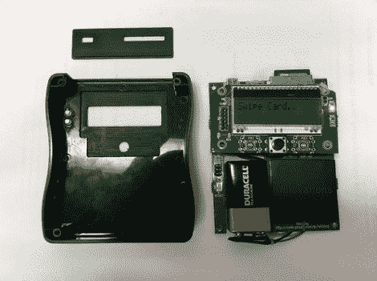

# 以正确的方式设计外壳

> 原文：<https://hackaday.com/2010/11/07/project-enclosures-the-right-way/>

[斯蒂芬·伊顿]创建了一个围栏，并在[的博客文章](http://blog.strobotics.com.au/2010/11/05/putting-the-project-into-an-enclosurepart-2-machining-the-case/)中[分享了他的过程。我们认为他评论说他的项目很少达到你想要为它们做一个外壳的程度是很有趣的。我们当然有很多裸露的 PCB 作品。但是到时候，我们认为他的制造方法是一个很好的选择。](http://blog.strobotics.com.au/2010/11/05/putting-the-project-into-an-enclosure-part-1/)

首先，他不是白手起家。他已经有了一个 SparkFun 项目案例。问题是如何让它适合你的情况。我们在过去使用过钻孔机、Dremel 和锉刀，结果还过得去，但除了一个精心设计的项目盒之外，没有什么会被误认为是其他东西。[Stephen]决定从盒子上磨出他需要的开口，这产生了专业的外观效果。他开始给 SparkFun 发电子邮件，询问他们是否可以给他一个项目箱和受资助者的 3D 模型。然后，他制作了 LCD 屏幕、led 光导管、按钮、USB 端口和 SD 插座。从那以后，它被用一个定制的夹具和一些我们认为你会喜欢的技巧送到了磨坊。最终的结果只是另一个理由来建立你已经想了很久的数控铣床。