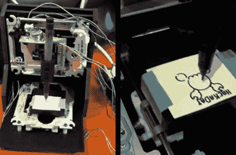

# PC 零件的数控机床

> 原文：<https://hackaday.com/2010/11/08/cnc-machine-from-pc-parts/>

[迈克·兰金]用一些个人电脑零件制造了一台小型数控机床[。他重新利用了两个光驱和一个软驱来创建绘图仪，上面画着 Hackaday 的标志。X 和 Y 轴使用两个光驱的步进电机控制的读取头。Z 轴是使用软驱中的读头硬件构建的。一个来自易贝的 3 轴控制器模块驱动这个小机器，使成本保持在 45 美元左右。](https://sites.google.com/site/0miker0/)

正如你在视频中看到的，作为绘图仪，它做得很好。[Mike]认为硬件中没有足够的能量用作磨机。我们仍然想尝试添加一个软轴旋转工具，看看这是否可以磨一些基本的 PCB，但也许你需要[为那个功能](http://hackaday.com/2010/06/21/100-cnc-mill/)多花一点钱。也可以使用抗蚀剂标记代替调色剂转移或光致抗蚀剂。

[https://www.youtube.com/embed/8U-TBf-mzkU?version=3&rel=1&showsearch=0&showinfo=1&iv_load_policy=1&fs=1&hl=en-US&autohide=2&wmode=transparent](https://www.youtube.com/embed/8U-TBf-mzkU?version=3&rel=1&showsearch=0&showinfo=1&iv_load_policy=1&fs=1&hl=en-US&autohide=2&wmode=transparent)