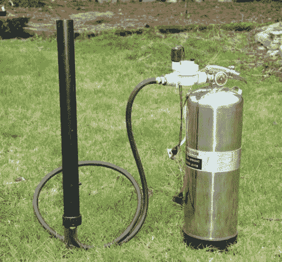

# 为你的下一次聚会做一个五彩纸屑炮

> 原文：<https://hackaday.com/2010/11/08/build-a-confetti-cannon-for-your-next-party/>

做了一个五彩纸屑罐来给派对增添趣味。它是气动的，可以把灭火器当作储气罐使用。他有一个可重复使用的灭火器，用水代替化学阻燃剂。在排空水并确保所有压力都已释放后，他将软管和喷嘴换成了喷水电磁阀。用管夹固定灭火器的启动杆，使内部阀门打开，让螺线管控制压力释放。这样，佳能就可以电子或手动发射。

这种电磁阀[是气动炮](http://hackaday.com/2008/02/17/the-2008-shmooball-gun/)的流行选择。我们认为你甚至可以把它改装成一个 [T 恤大炮](http://hackaday.com/2010/10/28/we-knew-we-were-doomed-when-the-t-shirt-cannon-bots-showed-up/)。

[谢谢 BoBeR182]