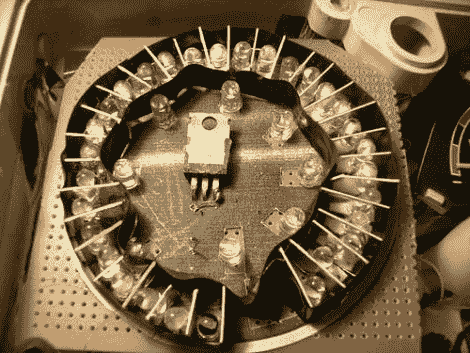

# 将速度表指针换成发光二极管

> 原文：<https://hackaday.com/2010/11/08/swapping-speedometer-needle-for-leds/>

[Ah2002]不喜欢他汽车里程表上摇摇晃晃的指针，所以他用一圈发光二极管取而代之。旧的速度计有一根随变速箱一起转动的电缆，用于机械测速。通过连接打印机的步进电机而不是这条电缆，产生的电压会随着汽车的速度而波动。波动是线性的，因此给定的电压测量可以直接与一个特定的速度相关联。通过使用 trimpot 校准输入电压，[Ah2002]将信号连接到 LM3914 点/条显示驱动器。这些可以链接在一起，根据单个电压输入点亮一串输出。结果就是上面看到的板子，在最后组装的时候用印刷好的纸质图形覆盖。

从休息后的视频来看，我们敢打赌在校准过程中有人分心驾驶。司机似乎拿着录像机，由于在校准过程中使用了手机 GPS，我们想知道[Ah2002]是否正在调整微调，查看 GPS，并同时驾驶。这是一个相当棒的技术，但是当你在做类似的事情时要小心。

[https://www.youtube.com/embed/wAUQjoejmOM?version=3&rel=1&showsearch=0&showinfo=1&iv_load_policy=1&fs=1&hl=en-US&autohide=2&wmode=transparent](https://www.youtube.com/embed/wAUQjoejmOM?version=3&rel=1&showsearch=0&showinfo=1&iv_load_policy=1&fs=1&hl=en-US&autohide=2&wmode=transparent)