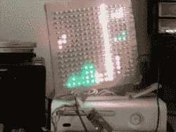
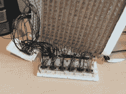
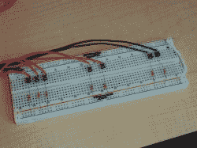
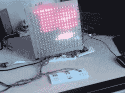
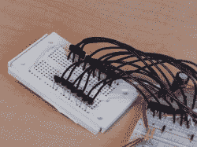
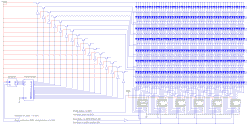

# AVR 控制的 RGB LED 矩阵播放俄罗斯方块

> 原文：<https://hackaday.com/2010/11/09/avr-controlled-rgb-led-matrix-plays-tetris/>

[Stan]使用 RGB LEDs 的 16×16 网格构建了这个 [LED 矩阵。他建造了硬件并编写了一些子程序来随机化颜色。他没有使用 PWM，因为帧缓冲对于他使用的 ATmega168 的 1k SRAM 限制是不可行的。相反，移位寄存器驱动可以混合实现八种不同颜色(包括黑色的关闭)的灯，从而将帧缓冲区大小减少到仅 96 字节。在他完成了构建之后，他意识到这对于一个俄罗斯方块游戏来说是合适的。我们已经看过](http://www.nerdkits.com/forum/thread/1026/) [AVR 俄罗斯方块](http://hackaday.com/2010/01/14/avr-tetris/)、 [PIC 俄罗斯方块](http://hackaday.com/2010/06/20/tetris-code-theory-explained/)和[使用复合视频的俄罗斯方块](http://hackaday.com/2010/01/18/more-avr-tetris/)，但看到新的显示器构建总是令人愉快的。

休息之后，我们嵌入了[Stan 的]演示视频、几张图片和一个原理图。他使用了我们的[如何设计 LED 矩阵教程](http://hackaday.com/2010/10/26/70-led-matrix-in-a-jack-o-lantern/)中概述的许多相同原则。

[https://www.youtube.com/embed/ugub6d65b2A?version=3&rel=1&showsearch=0&showinfo=1&iv_load_policy=1&fs=1&hl=en-US&autohide=2&wmode=transparent](https://www.youtube.com/embed/ugub6d65b2A?version=3&rel=1&showsearch=0&showinfo=1&iv_load_policy=1&fs=1&hl=en-US&autohide=2&wmode=transparent)

