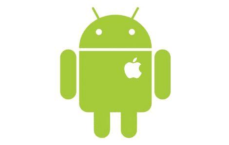

# IPhone 上的安卓系统:新的享受

> 原文：<https://hackaday.com/2010/11/09/android-on-iphone-new-treats/>

看起来 iPhone 2g 和 3g 是获得 Android 2.2 的最新手机，代号为 Froyo。如果你有一个[越狱](http://hackaday.com/2010/08/02/jailbreak-your-apple-products/)设备，安装 Froyo 的过程似乎每次都变得更容易，这次修订就像添加一个存储库，下载 Froyo，然后按 go 一样简单。按照链接一步一步的指导，完成截图，去掉所有的猜测工作。自从[我们第一次](http://hackaday.com/2010/04/22/android-on-the-iphone/)报道以来，iPhone 上的 Android 已经走过了很长的路。

[via [reddit](http://www.reddit.com/r/Android/comments/e3fkf/guide_to_install_android_221_froyo_on_iphone_2g/)