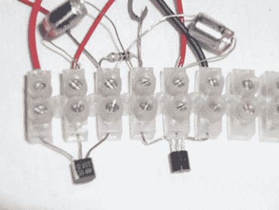

# 无焊图纸终端实施

> 原文：<https://hackaday.com/2010/11/09/solderless-drawdio-terminally-implemented/>

所以你被困在了一个无聊的课堂上，你无法抑制自己想黑东西来打发时间的冲动，甚至是你的铅笔。也许你正在进行一场现场电子展，你把你的合成器从楼梯上摔了下来，你只剩下一把元件、一个螺丝端子板和一支铅笔。这种情况有数千甚至数百万种，每一种的答案都是由[Martin]设计的[无焊 drawdio 克隆](http://www.parallelpoints.com/node/35 "Sound Words")。

你可能以前在这里见过原始的 [Drawdio](http://hackaday.com/2008/10/09/drawdio-kit-lets-you-make-music-while-you-draw/) ，这是一项有趣的技术，[简单到足以重现](http://hackaday.com/2008/11/08/stripboard-drawdio/)。这种最新的方法将成为黑客工作室的一个优秀的入门项目，因为该指南简单明了，并且没有焊接会使物流变得容易得多。结果与原始结果非常相似——休息后查看视频。

 <https://www.youtube.com/embed/ooOPQ4h2pq0?version=3&rel=1&showsearch=0&showinfo=1&iv_load_policy=1&fs=1&hl=en-US&autohide=2&wmode=transparent>

 </body> </html>