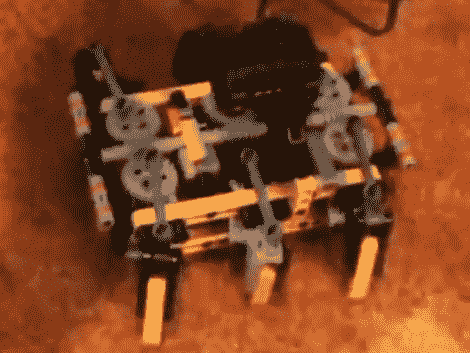

# Santa-Pede 挑战赛的单马达助行器灵感

> 原文：<https://hackaday.com/2010/11/10/single-motor-walker-for-santa-pede-challenge-inspiration/>

这个乐高六足机器人只用一个马达驱动。在广告之后的视频中，你可以看到[Valetnin Bauer]只用了 210 个零件就完成了几乎是不可思议的事情。中心驱动轴使用蜗轮将运动传递到每个腿上。肢体安装技术产生了一种划船运动，这种运动非常类似于你所期望看到的生物六足动物。

我们认为这可能会为[Buy Break Build:Santa-pede challenge](http://hackaday.com/2010/10/29/bbb-1-the-santa-pede-challenge/)提供一些灵感。当然，使用乐高比重复使用圣诞老人的零件要容易得多。但是，只要有一点创造力，就可以完成很多事情。另一个灵感点可能是[这个单马达步行机](http://www.instructables.com/id/How-to-build-the-one-motor-walker/)，它应该是适应挑战的一个快照。最好开始吧，离项目截止日期只有 20 天了！

 <https://www.youtube.com/embed/FeAY8XTzhWo?version=3&rel=1&showsearch=0&showinfo=1&iv_load_policy=1&fs=1&hl=en-US&autohide=2&wmode=transparent>

 
[通过<a href="http://tinkernology.blogspot.com/2010/11/lego-technic-hexapod-spider-l6.html" target="_blank">修补技术</a>
 </body> </html>