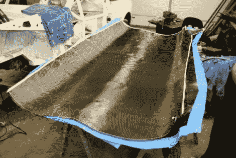

# 碳纤维零件制造指南

> 原文：<https://hackaday.com/2010/11/10/carbon-fiber-part-fabrication-guide/>

如果你正在考虑用碳纤维工作，这个指南会有很大的帮助。这个例子是针对汽车人群的，但是原理很容易转移。碳纤维零件的构造方式与玻璃纤维零件相似。用脱模剂覆盖模具，将纤维放置到位并用环氧树脂覆盖。对于玻璃纤维，纤维通常被喷涂，但是碳纤维部件使用材料的编织垫来构建多层。真空袋用于将各层固定在一起，去除空气并用环氧树脂浸渍纤维。该指南甚至概述了该步骤所需的真空泵的结构。

碳纤维的好处有很多，包括强度和重量减轻。这使得它成为向重量敏感的黑客添加部件的绝佳材料，如[四轴飞行器](http://hackaday.com/2010/09/08/easy-quadrotor-helicopter-instructions/)。但是这个网也有一个有趣的外观，这就是为什么它会出现在[的定制电子产品箱](http://hackaday.com/2010/06/08/windows-7-tablet-in-a-carbon-fiber-case/)中。一个真正的缺点是，当这种材料失效时，这是一种灾难性的失效，往往会破坏整个结构，而不是将破坏限制在一个小的区域。这意味着一个粗糙的着陆可能是你的新零件的结束。

[感谢 MS3FGX]