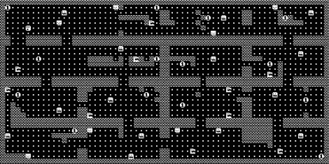

# 即时通讯(和 Linux)的地牢爬虫游戏

> 原文：<https://hackaday.com/2010/11/11/dungeon-crawler-game-for-im-me-and-linux/>

[Joby Taffey]为 IM 的第一个[完成的自制游戏获奖。在过去的几周里，我们看到[特拉维斯·古斯比]](http://blog.hodgepig.org/2010/11/11/im-me-roguelike/) [和[艾曼纽·罗塞尔]](http://hackaday.com/2010/11/01/im-me-graphic-manipulation-using-sprites/) [正在为粉色传呼机开发游戏音乐](http://hackaday.com/2010/11/07/im-me-plays-music-in-preparation-for-gaming/)。但是[Joby]并没有真正使用这些。

[Travis 的]精灵使用了一个帧缓冲区，它会占用大量宝贵的内存。[Joby]决定将房间屏幕(上图中的所有屏幕都已缝合在一起)绘制为一次性背景图像，以释放内存。从那里，屏幕根据光标移动以 8×8 块更新。他还决定不添加音乐，因为他觉得高音压电无法发出声音，否则会让每个人发疯。

源代码是可用的，对于那些没有这个漂亮的掌上电脑的人来说，这个游戏也可以在 Linux 下编译。