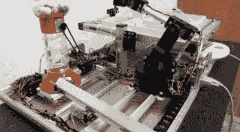

# 口香糖球迷宫更新…现在有机器人！

> 原文：<https://hackaday.com/2010/11/11/gum-ball-maze-updated-now-with-robots/>

在一台不断成长的鲁布·戈德堡机器中，[丹]更新了他的[口香糖球分配器，使其包括了一个机械臂](http://sites.google.com/site/teamtobor/marble-maze#TOC-Sneak-Peek-of-V2.0:)。大约一年前，我们看了这个人类实验室老鼠实验，T2 用泡泡糖奖励成功的迷宫导航。正如你在休息后的视频中看到的，他增加了几个新功能来取悦用户。原版有一个由加速度计驱动的迷宫，现在依然如此。但是当设备启动时，Lynxmotion 机械臂会将木球移动到迷宫的起点。这个手臂安装在轨道上，所以它也可以在成功运行后移动来传送口香糖球。还有一个抗干扰功能，可以摇动口香糖球分配器，以确保您不会空手而归。

无论是下棋还是被鼠标控制的 T2，Lynxmotion 最近都很流行。[丹的]解决方案使用真空泵抓取球体(木制和橡胶)，类似于不久前使用的[数控抓放](http://hackaday.com/2010/10/01/open-source-pick-and-place/)的方法。

 <https://www.youtube.com/embed/78ucwJMDe7o?version=3&rel=1&showsearch=0&showinfo=1&iv_load_policy=1&fs=1&hl=en-US&autohide=2&wmode=transparent>

 
[谢谢克里斯]
 </body> </html>