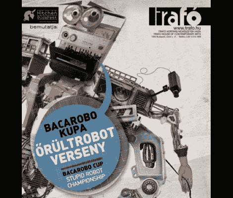

# 愚蠢的机器人

> 原文：<https://hackaday.com/2010/11/12/stupid-friggin-robots/>

一些机器人渴望伟大，以我们难以理解的方式彻底改变我们的类人行为。他们在太空旅行，像天体狗仔队一样拍摄星星，或者像星际入侵者一样绑架火星人。一些机器人很高兴有尊严和优雅地执行他们的日常功能，擦洗我们的地板，感谢我们的回收。

似乎每个机器人都有一个使命——无论是宏伟的还是卑微的——让它成为我们社会中有价值的一部分。不幸的是，事实并非如此。一些机器人没有很好地利用我们辛苦挣来的能量资源，无所事事，没有一个有用的功能，整晚喝着通量和补品，同时看着《迷失太空》的重播。他们是愚蠢的机器人。**

许多人认为这种可怜的机器人只不过是人类成就的激流中的漂浮物，但我们中更有同情心的人准备以盛大的方式庆祝愚蠢机器人的独特无用性。进入 [Bacarobo](http://bacarobo.kibu.hu/) ( [翻译](http://translate.google.ca/translate?hl=en&sl=hu&u=http://bacarobo.kibu.hu/&ei=goncTObON8z9ngfv450X&sa=X&oi=translate&ct=result&resnum=4&ved=0CDcQ7gEwAw&prev=/search%3Fq%3Dbacarobo%26hl%3Den%26client%3Dfirefox-a%26hs%3DSDi%26rls%3Dorg.mozilla:en-US:official%26prmd%3Div))，这是展示我们这个时代最古怪和最有趣的无用机器人的首要活动。

今年的比赛在 10 月底举行，参赛者们至少可以说很搞笑。跳舞的 olé-bot 赢得了很多掌声，而颤抖的无沿帽机器人不顾一切地试图逃离他们寒冷的监狱。考虑到原材料，看看[我们自己的圣诞机器人竞赛](http://hackaday.com/2010/10/29/bbb-1-the-santa-pede-challenge/)中是否会出现任何愚蠢可爱的机器人设计将会很有趣。如果你曾经制造过一个愚蠢的或者[无用的](http://hackaday.com/2009/12/30/simplest-most-useless-machine/)机器人(不管是不是偶然的),请在评论中分享你的故事。有时候，我们技术中最可爱的地方是那些[没有按照预期方式](http://www.youtube.com/watch?v=1-xXOEzgCak)工作的部分。