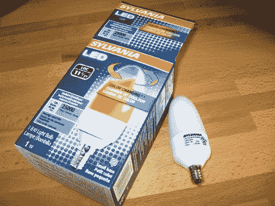
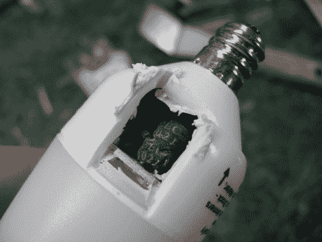
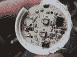
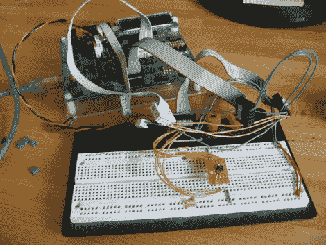

# 帮我逆向工程一个 LED 灯泡

> 原文：<https://hackaday.com/2010/11/12/help-me-reverse-engineer-an-led-light-bulb/>



我参加了第 67 区的最后一次月度会议，这是一个位于威斯康星州麦迪逊的黑客空间。其中一个展示的东西是一个变色 LED 灯泡，Menards 以 1.99 美元的价格出售。内部有两个由 ATtiny13 控制的 RGB LEDs，由交流/DC 降压转换器供电。一辆 ATtiny13 本身就要 1.25 美元左右，所以这个价格相当惊人。我抓了几个灯泡，开始做起来。休息过后，请加入我，看看我目前的成果。

**更新:** [看完这篇帖子的后续](http://hackaday.com/2010/12/09/part-2-help-me-reverse-engineer-an-led-light-bulb/)。

这些灯泡使用烛台底座，所以我拿了一个适配器，在灯里试了试。这是结果，你可以看到它每秒钟通过几次色阶:

[https://www.youtube.com/embed/yRrYp3qRBXc?version=3&rel=1&showsearch=0&showinfo=1&iv_load_policy=1&fs=1&hl=en-US&autohide=2&wmode=transparent](https://www.youtube.com/embed/yRrYp3qRBXc?version=3&rel=1&showsearch=0&showinfo=1&iv_load_policy=1&fs=1&hl=en-US&autohide=2&wmode=transparent)

我们已经在许多[情绪灯黑客](http://hackaday.com/2009/11/17/diy-mood-lamp-looks-store-bought/)中看到了这一点，我想获得硬件并让它为我服务。首先，是时候打开它了。出于某种原因，我认为小心地在底座周围钻几个洞将有助于我找出在哪里最好地使用 Dremel 切割轮。不幸的是，我立即钻透了一个电感线圈。Drat。



现在不能停下来。我不太担心，因为我还买了一个纯红版本的灯泡。我想看看里面有什么，是相同的设计和未填充的组件，还是不同硬件的完整 shebang。我假设里面没有微控制器，所以我稍后会从那个里面偷电感。

我切断了扩散器，找到了电路板。这里有一些图片(点击观看高清图片)以及硬件的粗略列表。

[ ](http://hackaday.com/wp-content/uploads/2010/11/top-side-of-board.jpg) [ ](http://hackaday.com/wp-content/uploads/2010/11/underside-of-board.jpg)

顶部:

*   R2——1004 年
*   R3–1004
*   R4-3001
*   r5–1302
*   r10–1003
*   down 看起来像一个齐纳二极管……也许是为了给 13 号电池设定电压
*   D5–RGB LED
*   D6–RGB LED
*   D7–JF S1J
*   ic5 阿蒂尼 13
*   C1–无标签贴片
*   无标签的 C7- smd

底部:

*   R1-与灯座的中心导体成直线
*   P1 和 P2——输入交流电的标签？
*   L1-102j CEC
*   L2-102j CEC
*   C2-50V 22 uF 电解
*   C3-400 伏 4.7 微法电解
*   C4-400 伏 4.7 微法电解
*   C5–25V 100 uF 电解
*   C6–无标签贴片
*   D3–R106 TF
*   R6——1201 年
*   r7–1Bx
*   R8–270
*   r9 270
*   IC1–NGS(用于驱动发光二极管的晶体管？)
*   IC2–NGS(用于驱动发光二极管的晶体管？)
*   IC3–NGS(用于驱动 led 的晶体管？)
*   IC4–lnk 304 gn 交流/DC 开关转换器

我想看看我是否能和 ATtiny13 通话，所以我把电线焊接到针脚上，然后把它接到我的 AVR Dragon 编程器上。ISP 是一个没有去，所以我焊接更多的电线到剩余的连接，并给高压编程一个镜头。这也是一个失败。但是因为我已经冲洗了电感，所以我不介意将微处理器从电路板上弹出来。这里，它被焊接到某个 perfboard 上，并插入试验板:



我又试了一次 ISP，但没有成功。但是这次高压串行编程成功了。我使用以下命令与 AVRdude 的芯片进行了对话:

```
avrdude -P usb -p t13 -c dragon_hvsp -v
```

轮询芯片并读取保险丝设置。目前，lfuse 为 0x6A，这是出厂默认设置，但 hfuse 为 0xFA。查看数据手册后，我发现他们禁用了复位功能(这就是 ISP 不工作的原因)，并启用了掉电检测。我清空了固件和 eeprom，这就是我现在的状态。现在我需要你的帮助。

在此之前，我没有做过多少逆向工程，所以我不确定接下来该做什么。我用“ndisasm”反汇编了固件，但我不知道我能从中学到什么，甚至不知道如何阅读它。我希望有人能帮我回答两个问题:

1)当芯片在电路板上时，为什么我无法与芯片对话？

2) ~~从[反汇编代码](http://pastebin.com/FVrKYQCZ)~~ 中能学到什么。**更新:**通过 AVR 反汇编程序运行代码后，看起来这只是一个数字的升序列表。[Tiago]在评论中指出，这是锁定位已经设置时的行为。应该可以通过擦除来重新使用芯片，但我不能首先转储固件。现在，我将重点弄清楚电路板的布线方式。

请在评论中告诉我。

[阅读第二部分](http://hackaday.com/2010/12/09/part-2-help-me-reverse-engineer-an-led-light-bulb/)