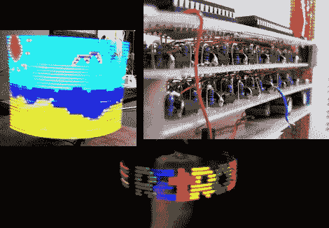

# 很多旋转的 POV 善良

> 原文：<https://hackaday.com/2010/11/13/lots-of-spinning-pov-goodness/>

[Retrobrad 的] [旋转视点显示](http://www.youtube.com/watch?v=gklBWwGyreM)一直是我们的最爱。当它今天早上再次出现在我们的视线中时，我们惊讶地发现我们从来没有在它上面做过专题报道！但是现在有更多的东西可以分享。点击[页面](http://bradsprojects.com/)顶部的项目图标，你不仅会得到 8×85 RGB 显示器的构建说明，而且他还构建了一个 32×64 像素的旋转显示器。

即使你不打算做这些，他也解释了一些在其他情况下有用的像素图形技术。查看他的视频[,使用电子表格创建 8×85 显示器每帧所需的十六进制数组](http://www.youtube.com/watch?v=0f5I2jG72h4)。在休息之后，它和两个显示器的演示一起被嵌入。

[https://www.youtube.com/embed/0f5I2jG72h4?version=3&rel=1&showsearch=0&showinfo=1&iv_load_policy=1&fs=1&hl=en-US&autohide=2&wmode=transparent](https://www.youtube.com/embed/0f5I2jG72h4?version=3&rel=1&showsearch=0&showinfo=1&iv_load_policy=1&fs=1&hl=en-US&autohide=2&wmode=transparent)

[https://www.youtube.com/embed/gklBWwGyreM?version=3&rel=1&showsearch=0&showinfo=1&iv_load_policy=1&fs=1&hl=en-US&autohide=2&wmode=transparent](https://www.youtube.com/embed/gklBWwGyreM?version=3&rel=1&showsearch=0&showinfo=1&iv_load_policy=1&fs=1&hl=en-US&autohide=2&wmode=transparent) [https://www.youtube.com/embed/vTCIJILSgBo?version=3&rel=1&showsearch=0&showinfo=1&iv_load_policy=1&fs=1&hl=en-US&autohide=2&wmode=transparent](https://www.youtube.com/embed/vTCIJILSgBo?version=3&rel=1&showsearch=0&showinfo=1&iv_load_policy=1&fs=1&hl=en-US&autohide=2&wmode=transparent)

[via [被黑的小工具](http://hackedgadgets.com/2010/11/12/rgb-spinning-display/)