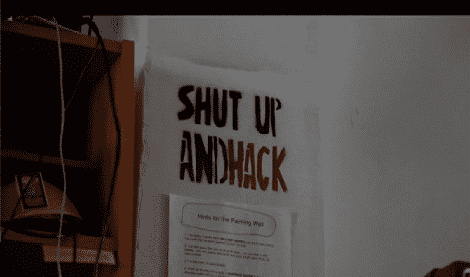

# 机器的最后一击:赢家

> 原文：<https://hackaday.com/2010/11/13/final-take-on-the-machine-winners/>

《司祭盎与米奇·奥特曼对抗机器》的最后一集终于来了。在这一集里，所有的队伍都回顾了他们的成功和失败，明显的赢家被放在最上面。我们不是破坏惊喜的人，所以你只需点击链接并观看就能找到答案。

但是让我们花一点时间来记住每个团队、[晶体管](http://hackaday.com/2010/11/07/the-transistor-takes-on-the-machine/)和他们的真人僵尸游戏。[坠毁空间](http://hackaday.com/2010/10/21/crash-space-takes-on-the-machine/)和他们的音乐大楼。[泵站:一台](http://hackaday.com/2010/10/14/pumping-station-one-takes-on-the-machine/)和他们的冰淇淋机。[工匠收容所](http://hackaday.com/2010/10/28/artisans-asylum-takes-on-the-machine/)和他们的早餐机。最后， [NYC 电阻](http://hackaday.com/2010/10/07/nyc-resistor-takes-on-the-machine/)和他们的饮料混合老虎机。

谁准备好下一季了？你说没有下一季了？也许一个新的受赞助的黑客空间竞赛会涌现，或者整个概念会像它来的那样迅速消亡。无论哪种方式，都是为了钱、乐趣和教育经历，对吗？这才是最重要的。

[谢谢德文，很遗憾你们没有赢。]