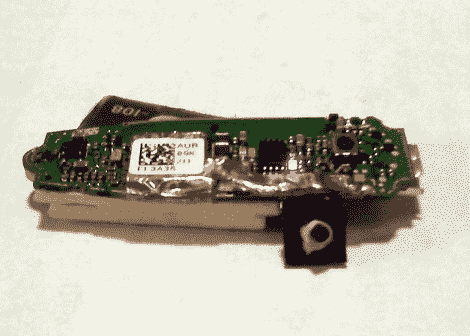
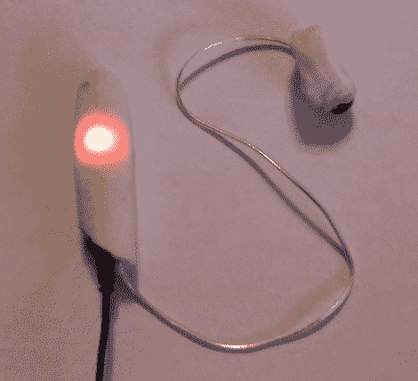
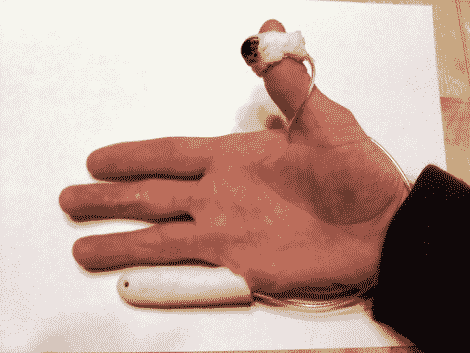

# 对不起，我的小手指在响

> 原文：<https://hackaday.com/2010/11/15/excuse-me-my-pinky-is-ringing/>

我们收到很多电子邮件，挑战我们去黑东西。有时我们忽略他们，有时我们发送一些鼓励的话。但这一次，我们认为[Tait]真的想出了一个伟大的黑客；在他的假手指上安装蓝牙手机。他在过去没有做过太多的黑客工作，他想知道我们是否可以向我们的读者提出一个挑战来实现这一点。经过一番反复的头脑风暴后，他决定亲自接受挑战，并取得了巨大的成功。

像其他蓝牙手机一样，黑客从一个简单的耳挂模块开始。他用一块塑料延长了音量按钮，并把它放在电池下面。几根木制火柴杆将电池隔开足够的距离，这样就可以挤压它来调节音量。然后他用一些电线延长了扬声器。接下来，他用[我们上一篇文章](http://hackaday.com/2010/10/11/oogoo-a-home-made-sugru-substitute/)中的 Oogoo 配方制作了一个假手指和一个拇指戒指。PCB 和电池适合手指，这将麦克风放在塑料小手指垫上的一个孔附近。拇指环容纳扬声器，以完成外观。不要错过休息后发来的照片[Tait]。

蓝牙模块 PCB:

完成的原型仍然可以充电:

它非常合身:

最初他告诉我们这个黑客超出了他的技术水平。恭喜你…看起来你的黑客技术又上了一个台阶！