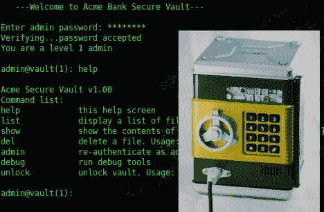

# 用玩具金库玩黑客

> 原文：<https://hackaday.com/2010/11/15/playing-hacker-with-a-toy-vault/>

通过给这个玩具金库添加一些电路，托马斯·坎农创造了他自己的黑客游戏。最初的玩具使用键盘来控制螺线管保持门关闭。他保留了机械设置，但用他自己的基于 ATmega328 的内部元件替换了原来的电路板。他还在前面增加了一个 USB 端口。这个游戏的要点是，你通过 USB 插件来访问保险库的终端软件。如果你能通过各种级别的管理权限，里面的战利品将是你的。