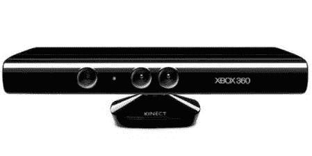

# 学习逆向工程

> 原文：<https://hackaday.com/2010/11/17/learn-to-reverse-engineer/>

我们收到的最常见的电子邮件是“我如何学习如何黑东西？”。看起来[ladyada]也经常被问到这个问题。她没有浪费任何时间来写一个逐步的指南来逆向工程 USB 设备，特别是 Kinect。

她深入探讨了 USB 是如何工作的，如何记录通信，寻找什么，如何解构你所发现的，以及如何将这些都用上。这一切都是通过 Kinect 的真实世界数据完成的，所以你可以在家里轻松跟随。有可用的源代码，所以你可以下载她的例子，看看如何控制设备。

我们希望每一个黑客都可以写得如此之好，以至于它也可以被称为一个教程。