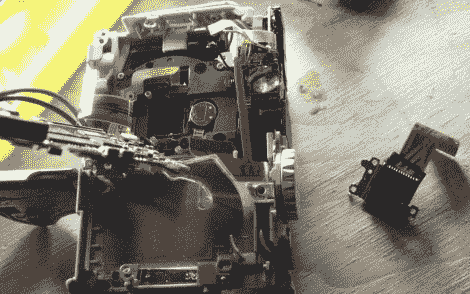

# 用傻瓜相机看红外线

> 原文：<https://hackaday.com/2010/11/17/make-a-point-and-shoot-see-infrared-light/>

[丹尼尔·里茨]已经染上了 Kinect 黑客热。但是他需要一个重要的工具来完成他的工作；能看到红外光的相机。这应该不难实现，因为数码相机中的传感器完全有能力完成这项任务，但它需要移除红外滤光器。在[丹尼尔]的案例中，他[拆卸了一个佳能 Powershot](http://www.futurepicture.org/?p=97)来接近那个过滤器。那些傻瓜相机机身里装了很多东西，他的拆机照片讲述了这个故事。他在把它重新组装起来后，也有了额外的部分，但这似乎并没有造成任何伤害。

休息之后，你可以看到视频显示 Kinect 的斑点红外网格，这就是为什么他首先需要红外感应。但在他的帖子底部也有一些有趣的照片，显示了通过移除滤镜在户外摄影中实现的效果。

闪光灯再也没有回到相机里。那是红外光源的完美位置。这样你就有了一个夜视摄像头。

 <https://www.youtube.com/embed/28JwgxbQx8w?version=3&rel=1&showsearch=0&showinfo=1&iv_load_policy=1&fs=1&hl=en-US&autohide=2&wmode=transparent>

 </body> </html>