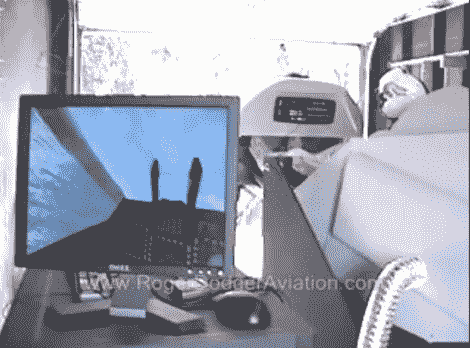

# 平衡良好的飞行模拟器

> 原文：<https://hackaday.com/2010/11/18/well-balanced-flight-simulator/>

这里有一个飞行模拟器，它使用的概念简单到任何人都可以建造。当你驾驶虚拟飞行器时，你所坐的驾驶舱也会随之移动。但是与我们已经看到的一些[更极端的](http://hackaday.com/2010/05/31/flight-simulator-but-youre-the-plane/) [模拟器不同，它使用基本的材料和简单的概念来提供运动。它的重心在一个底座上保持平衡。当你上下移动机头时，操纵杆滑动，改变重心，导致驾驶舱倾斜。飞行员通过可穿戴式显示器观看模拟飞行。在他面前有一个固定的参照物，这使得系统可以测量头部的运动，平移和倾斜虚拟显示器以进行匹配。休息后查看一下视频概述，或者点击上面链接的页面，观看所有 22 集的视频构建日志。](http://hackaday.com/2009/12/21/four-generations-of-motion-simulators/)

[https://www.youtube.com/embed/RrC0_EFnLFE?version=3&rel=1&showsearch=0&showinfo=1&iv_load_policy=1&fs=1&hl=en-US&autohide=2&wmode=transparent](https://www.youtube.com/embed/RrC0_EFnLFE?version=3&rel=1&showsearch=0&showinfo=1&iv_load_policy=1&fs=1&hl=en-US&autohide=2&wmode=transparent)

【通过 [DIYdrones](http://diydrones.com/profiles/blogs/diy-flight-simulator) 通过 [Make](http://blog.makezine.com/archive/2010/11/diy_flight_simulator_motion_rig.html) 感谢 Bill 和 Charper】