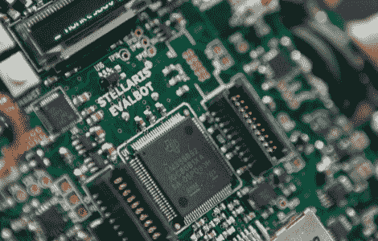

# 五个免费评估机器人

> 原文：<https://hackaday.com/2010/11/18/five-free-evalbots/>

如果你是黑客空间的一员，并且你一直希望一个 evalbot 能够徒手将其撕碎，那么你很幸运！[戴夫·布洛克]正在向随机挑选的五名幸运黑客分发五个评估机器人。我们认为前几天看到的[125.00 美元的交易](http://hackaday.com/2010/10/04/125-off-the-evalbot-is-a-steal/)很好，但这是完全错误的！

抽奖是在黑色星期五，所以你有几天的时间来提交你的详细资料。到目前为止，我们只有一些关于 evalbot 的帖子，包括硬件的初始检查和 USB 电源修改。我们很想知道人们会把它带到哪里，我们也很想知道这些免费的“机器人”会变成什么样。对于那些已经在开发 evalbot 的人来说，继续努力，拍很多照片吧！

[图片来源:[戴夫·布洛克](http://davebullock.com)来自 [eecue](http://eecue.com)