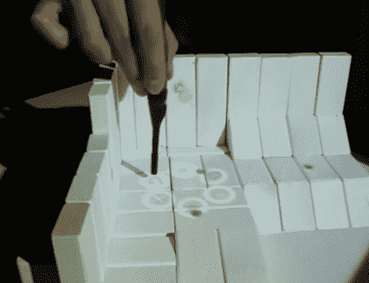

# 投影仪将增强现实引入现实

> 原文：<https://hackaday.com/2010/11/19/projector-introduces-augmented-reality-to-reality/>

[Raj Sodhi]和[Brett Jones]一直致力于交互式增强现实，作为他们在伊利诺伊大学研究的一部分。他们想出的是[一种基于手写笔的输入系统，可以使用物理对象来创建虚拟景观](http://augmentedengineering.wordpress.com/2010/10/06/build-your-world-and-play-in-it/)。上面你可以看到一个环境是用白色积木搭建的。相机映射出与物理设计相匹配的虚拟世界。从那里可以用一个红外笔来操作投射在积木上的虚拟数据。

他们创造了一个非常先进的红外白板。触控笔上有按钮，其中一个按钮可以打开菜单，由上面可以看到的圆圈组成。从那里，你可以选择一个工具，让它为你服务。休息之后，会有一个视频演示，游戏开始了，使用菜单将坦克和地雷放置在 3D 游戏场上。我们想知道用投影仪和[Kinect](http://hackaday.com/2010/11/11/open-source-kinect-contest-has-been-won/)来做这件事会有多难。

[https://player.vimeo.com/video/12154930](https://player.vimeo.com/video/12154930)