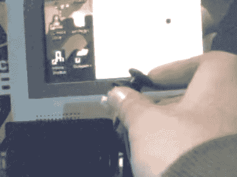

# Arduino + Java +操纵杆

> 原文：<https://hackaday.com/2010/11/19/arduino-java-joystick/>

把你自己的硬件和 Java 应用程序连接起来再简单不过了。[Pn]使用 Arduino、游戏控制器的模拟操纵杆和几行 Java 代码创建了这个概念验证。Arduino 从操纵杆的 x 轴读取 ADC 值，并通过串行连接每秒传输十次。Java 程序在每个串行事件上触发，根据 Arduino 作为开始和结束条件发送的@符号解析数据。

我们喜欢这种例子，因为没有额外的内容。它可以让你在任何可以想象的项目中运用这个概念。无论是更复杂的操纵杆还是你想与之交互的简单传感器。