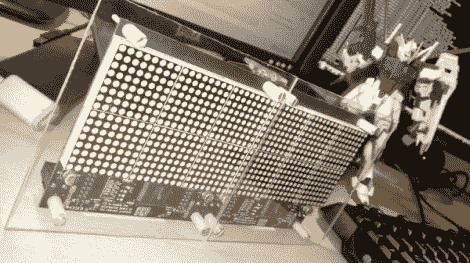

# 与 LED 矩阵通信

> 原文：<https://hackaday.com/2010/11/19/communicating-with-an-led-matrix/>

我们发布的大多数 LED 矩阵帖子都深入探讨了硬件设计。这一次[J Bremnant]使用了预制模块，[专注于编写代码来处理显示器](http://jbremnant.wordpress.com/2010/11/19/led-matrix-canvas/)。硬件结合了 Sure Electronics 的两个 24×16 LED 板和一个 Teensy 2.0 来驱动显示器并提供 USB 连接。固件的容量不到 8k，把图形处理留给了个人电脑。

[J brem nant]Python 脚本在处理显示时提供了很大的灵活性。通过终端界面有三种模式可供选择。人们只是测试一下显示器，然后就进入康威的生活游戏。第二种模式允许您通过串行接口发送命令，因此它可以用作消息收报机。最后一个特性是帧寻址，它允许将图形放入显示器。广告之后，请观看视频中的每一项内容。

 <https://www.youtube.com/embed/Yuv5SUVp5ik?version=3&rel=1&showsearch=0&showinfo=1&iv_load_policy=1&fs=1&hl=en-US&autohide=2&wmode=transparent>

 </body> </html>