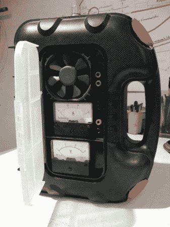
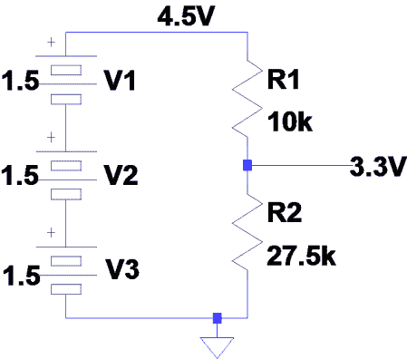
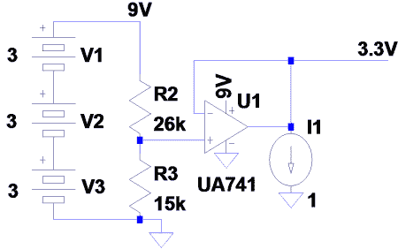
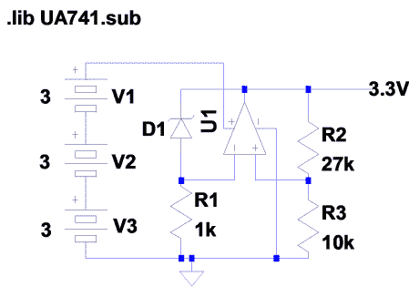

# 初学者概念:为您的项目提供动力

> 原文：<https://hackaday.com/2010/11/20/beginner-concepts-powering-your-projects/>

给你的电子设备供电似乎是一种必要的罪恶。为了帮助解决这个问题，[Felipe La Rotta]使用 PC 电源和 LM317 可调稳压器制作了一个非常好的[台式电源](http://hackedgadgets.com/2010/11/14/diy-bench-power-supply/)。PC 电源是开关电源的一个例子(后面会详细介绍)。LM317 是一种线性稳压器，允许通过改变一些电阻来调整输出电压。给电路供电的最佳方式是什么？那要看情况了…

通常为你的产品供电的第一步是电池，它们简单、便宜，并且可以串在一起以获得足够接近你需要的电压(嘿，有时这真的没那么重要)。但是当你超级挑剔的传感器只接受 3.3V 的时候你怎么办？快速肮脏的分压器会将电池电压降低到 3.3V。

不幸的是，传感器越拉分压器，它就离 3.3V 越远。这是负载调节的基本原理。一般的想法是，你需要的电流越大，你的电压就越远。如果有一个缓冲器，电路根本不会影响分压器呢？可能是这样的。

但是过了一天左右，传感器就不太准确了。进入传感器的电压现在只有 2.8V，这是分压器的第二个问题；它对电源电压很敏感。这叫线规。基本上，随着电池电压下降，输出电压也会下降。有用的是一个不变的电压，这样输出可以基于它。这里是齐纳二极管出现的地方。齐纳二极管两端的电压是在制造时设定的，它相对于电流变化很小(在它击穿后)。现在，齐纳二极管可以用作基准电压源，然后运算放大器将其缓冲到输出端。

这是电压调节器如何工作的一般概念。幸运的是，没有必要为每个项目都制作一个这样的产品，因为公司会把它们装在漂亮的 3 针小包装里出售。你只需将未调节电压接地，它就会调节第三个引脚上的输出。线性调节器解决了负载和线路调节问题，大家都满意，对吧？也许不是。比方说，一个调节器从电池获得 9V 电压，并向一个电路提供 3.3V 电压，电路通过吸收 500mA 电流做出响应。这意味着进入调节器的功率为 9V*500mA = 4.5W，从调节器输出的功率约为 3.3V*500mA=1.65W，另一个 2.85W 发生了什么？它在调压器内部作为热量被烧掉了。这意味着只有大约 57%的电力能够到达负载；剩下的都浪费了。

进入开关模式电源(如您电脑中的电源)。这些电路使用电感器、电容器和开关(晶体管)来实现更高的效率。它们通过不断调整流经电感的电流来产生更高或更低的输出电压。开关电源可能效率更高，但也更复杂、更难实现，而且电路噪声可能相当大。

所以一般来说:

分压器:非常简单，便宜，不好调节

线性电压调节器:简单，调节好，效率差

开关电源:硬、噪声大、效率高