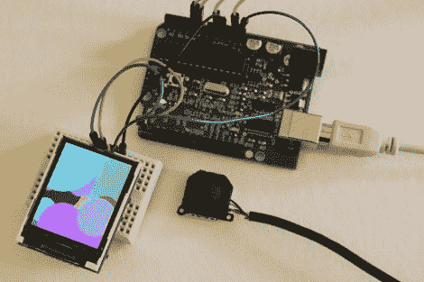

# SmartLCD 让微控制器视频变得简单

> 原文：<https://hackaday.com/2010/11/21/smartlcd-makes-video-for-microcontrollers-easy/>

[Rossum]开发了一种主板，使用廉价的微控制器可以轻松地[驱动 TFT 屏幕。他的](http://rossum.posterous.com/a-smarter-display)[看了看一堆容易买到的 LCD 的](http://hackaday.com/2010/10/14/touring-the-available-nokia-lcd-screens/)，决定 iPod Nano 2G 屏幕是性能(176×132 TFT)和低成本(1-5 美元)的正确平衡。与他们交谈并不特别困难，但由于有 22 个引脚，他们有点硬件饥饿。

他带我们通过信号嗅探来了解通信过程。在那里，他利用 ARM Cortex M0 处理器的能力来驱动屏幕，他过去曾与该处理器合作过。他的实现产生了一个名为 SmartLCD 的驱动板，它负责屏幕的并行协议、电源和背光。从那里开始，它只有四个连接，你可以轻松地使用像上面看到的 Arduino 那样的小型微控制器。休息之后看看它能做什么。

 <https://www.youtube.com/embed/sQVbI7Ss4ns?version=3&rel=1&showsearch=0&showinfo=1&iv_load_policy=1&fs=1&hl=en-US&autohide=2&wmode=transparent>

 </body> </html>