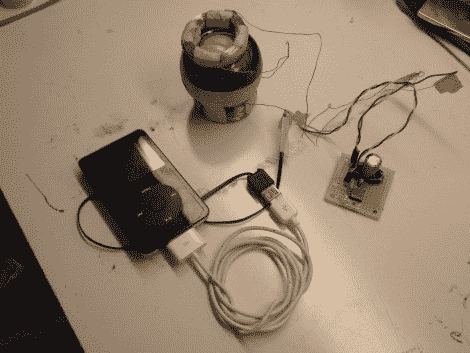

# 可笑的锻炼者变成了有用的充电器

> 原文：<https://hackaday.com/2010/11/22/ridiculous-exerciser-become-useful-as-a-charger/>

[Scott Nietfeld] [用 Dyna-flex](http://scott-n.com/wp/?p=19) 腕力训练器制作了一个充电器。我们以前从未听说过这种回转仪，但当我们看到宣传片(插播在广告之后)时，我们意识到这是商业信息片中用来销售的东西。[斯科特]知道内部旋转到相当高的转速，并认为在内部增加一些磁铁和外部线圈将把这东西变成一个发电机。四个稀土磁体符合要求，两个外部线圈为整流器和线性调节器供电。下面你可以看到他的演示视频，他把球体拆开，然后旋转它，在大约 7.5 伏的电压下产生 250 毫安的电流来驱动调节器和给手机充电。还不错！

Dyna-flex 宣传视频

 <https://www.youtube.com/embed/r5cM84qSj5o?version=3&rel=1&showsearch=0&showinfo=1&iv_load_policy=1&fs=1&hl=en-US&autohide=2&wmode=transparent>

 
[Scott 的]演练视频:
 <iframe class="youtube-player" width="800" height="480" src="https://www.youtube.com/embed/BqLHxbneAus?version=3&amp;rel=1&amp;showsearch=0&amp;showinfo=1&amp;iv_load_policy=1&amp;fs=1&amp;hl=en-US&amp;autohide=2&amp;wmode=transparent" allowfullscreen="true" style="border:0;" sandbox="allow-scripts allow-same-origin allow-popups allow-presentation"/> </body> </html>