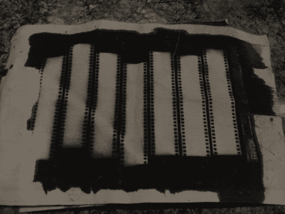

# 混合你自己的照片显影乳剂

> 原文：<https://hackaday.com/2010/11/22/mix-your-own-photo-developing-emulsions/>

如果你想自己冲洗照片，你可以试着混合自己的感光乳剂。[吉米·哈特尼特]发现了用氯化银制作感光介质所必需的化学反应。他的过程让他制造出可以像照片纸一样使用的画布。它的要点是在画布的背面涂上[石膏](http://en.wikipedia.org/wiki/Gesso)，以防止乳液完全渗透。然后，他让画布面朝下浮动，涂上乳液，并在乳液凝固前用直尺刮平。你可以在上图中看到一些接触印痕测试的结果。如果有的话，这是一件伟大的艺术品，可以挂在墙上，因为它在视觉上很有趣，而且[吉米]有个人联系，因为他不仅自己制作了它，而且提出了这个过程。