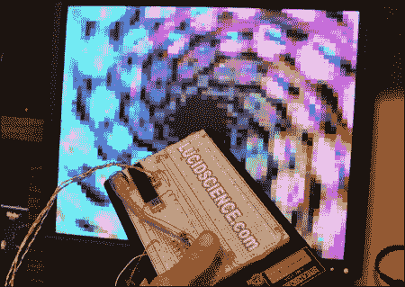

# VGA 接口 AVR 微控制器

> 原文：<https://hackaday.com/2010/11/23/vga-interfacing-avr-microcontrollers/>

[Lucidscience]又回来了，这次向我们展示了如何从 AVR 项目将数据[推送到 VGA 监视器。事实证明，它非常简单，只需要 n 个开放端口和一些电阻和二极管。嗯，最基本的版本就是这么简单，给你 56×60 像素。当然，他无法忍受这种情况，必须扩张。版本 2 输出 240×240 分辨率，并具有额外的 sram 和双缓冲区，使动画更流畅，无闪烁。像往常一样，该项目是很好的文件与整个建设过程的照片和图表，供您建立自己的。休息之后，我们将提供版本 1 和版本 2 的视频。](http://www.lucidscience.com/pro-vga%20video%20generator-1.aspx)

[via [HackedGadgets](http://hackedgadgets.com/2010/11/19/avr-microcontroller-vga-output/)

 <https://www.youtube.com/embed/lf3nFvhR7ps?version=3&rel=1&showsearch=0&showinfo=1&iv_load_policy=1&fs=1&hl=en-US&autohide=2&wmode=transparent>

 
<iframe loading="lazy" class="youtube-player" width="800" height="480" src="https://www.youtube.com/embed/o0_P4FiNiEY?version=3&amp;rel=1&amp;showsearch=0&amp;showinfo=1&amp;iv_load_policy=1&amp;fs=1&amp;hl=en-US&amp;autohide=2&amp;wmode=transparent" allowfullscreen="true" style="border:0;" sandbox="allow-scripts allow-same-origin allow-popups allow-presentation"/>
 </body> </html>