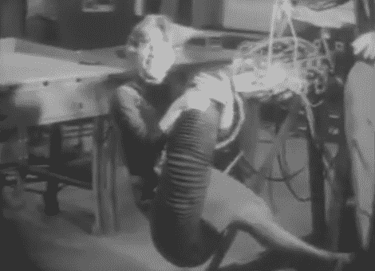

# "强壮到足以举起一个人，但温柔到足以拥抱一个孩子."

> 原文：<https://hackaday.com/2010/11/28/strong-enough-to-lift-a-person-yet-gentle-enough-to-embrace-a-child-%e2%80%9d/>

早在动漫出现之前，触须就已经激发了人类的恐惧和尊敬。一想到伟大的北海巨妖，或者那条来自海底 20000 里格的章鱼，水手们就不寒而栗。毫不奇怪，至少自 20 世纪中叶以来，人类就一直试图通过技术形式来利用这种恐惧和尊重。

触手机器人的迷人世界已经走过了漫长的道路。过去，触手机器人技术的每一项突破都必须以军事或厌恶女性的应用来证明，正如 1968 年麻省理工学院的这个杰出项目所展示的。

值得庆幸的是，我们的社会已经从那些被误导的时代开始前进，虽然仍然有无处不在的军事工业综合体在推动触手作战机器人的发展，但像[festo]这样在国内战线上有远见的人表明，至少我们中的一些人希望使用触手机器人来实现[和平、爱情和食物处理](http://www.engadget.com/2010/04/26/festos-strong-and-agile-robot-arm-is-based-on-the-elephants-tr/)。

休息后看视频。

 <https://www.youtube.com/embed/JuXQPdd0hjI?version=3&rel=1&showsearch=0&showinfo=1&iv_load_policy=1&fs=1&hl=en-US&autohide=2&wmode=transparent>

 </body> </html>