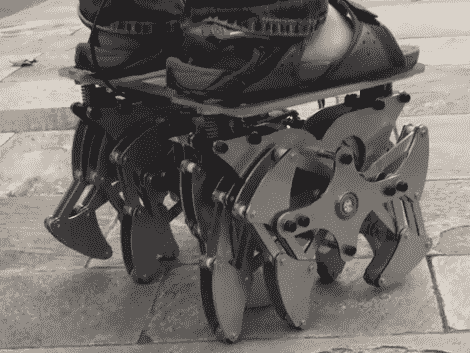

# 十二足机器人将取代赛格威成为未来交通工具

> 原文：<https://hackaday.com/2010/11/26/dodecapod-to-offset-segway-as-futuristic-transport/>

谁不喜欢一个 12 条腿的机器人，尤其是当你可以骑着它到处工作的时候？你可以看到它绕着院子跑，骑手坐在它上面。机器翻译有点粗糙，但它似乎是基于【西奥·詹森】的[邪恶行走雕塑。骑手可以转移他们的重心来控制步行机，就像赛格威一样。我们敢打赌，除了光滑的水平表面之外，这在任何情况下都很难骑行，但我们只适合室内使用。毕竟，您需要靠近充电站，因为当运送 165 磅的操作员时，它可以提供 45 分钟的电力。休息后看它疾走。](http://hackaday.com/2010/03/24/theo-jansen-like-the-professor-from-gilligan/)

 <https://www.youtube.com/embed/U5dpGAw4cOU?version=3&rel=1&showsearch=0&showinfo=1&iv_load_policy=1&fs=1&hl=en-US&autohide=2&wmode=transparent>

 
[通过<a href="http://www.neatorama.com/2010/11/24/little-12-legged-robot-can-transport-175-pounds/" target="_blank"> Neatorama </a>和<a href="http://www.popsci.com/technology/article/2010-11/video-12-legged-rideable-robot-lets-you-surf-pavement" target="_blank"> PopSci </a>
 </body> </html>