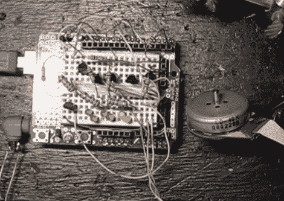

# Arduino 电子速度控制解释

> 原文：<https://hackaday.com/2010/11/26/arduino-electronic-speed-control-explained/>

你可以从光驱中回收一些不错的马达，但是它们很难控制。这是因为无刷 DC 电机需要在一个称为电子速度控制(ESC)的过程中使用精心定时的信号。使用 Arduino 和[构建和 ESC 的【Fileark】有几个](http://www.filear.com/index.php/arduino/71-variable-speed-arduino-esc-1-of-2)的[帖子](http://www.filear.com/index.php/arduino/73-variable-speed-arduino-esc-2-of-2)解释这个概念并演示它如何工作。他的测试电路使用六个 2N2222 晶体管来保护 Arduino 免受过大电流的影响。你可以看到上面的六个红色发光二极管与教学晶体管的基础成一直线。这在晶体管切换时提供了视觉反馈，对排除电路故障有很大帮助。

一旦你看过休息后的视频，你可能会得出结论，这是一个不切实际的方式来使用无刷电机。但是这是一个学习和体验 ESC 概念的好方法。你有机会免费得到一个旧光驱，这是一个便宜的周末项目。

 <https://www.youtube.com/embed/ZL0YqvxwTKc?version=3&rel=1&showsearch=0&showinfo=1&iv_load_policy=1&fs=1&hl=en-US&autohide=2&wmode=transparent>

 <iframe class="youtube-player" width="800" height="480" src="https://www.youtube.com/embed/LRZXTG6SEEM?version=3&amp;rel=1&amp;showsearch=0&amp;showinfo=1&amp;iv_load_policy=1&amp;fs=1&amp;hl=en-US&amp;autohide=2&amp;wmode=transparent" allowfullscreen="true" style="border:0;" sandbox="allow-scripts allow-same-origin allow-popups allow-presentation"/> </body> </html>