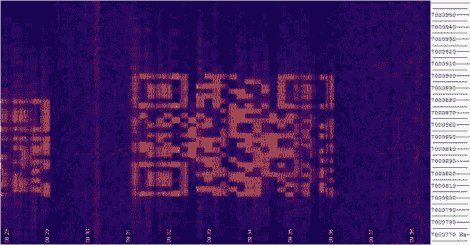

# 无线电运营商面临的条形码挑战

> 原文：<https://hackaday.com/2010/11/27/barcode-challenge-for-radio-operators/>

[Scott Harden]看到了一些关于 QR code matrix 条形码通过 40 米波特无线电波段传输的帖子。一些操作员捕捉到了信号，并将它们组装成上面看到的代码块，但他们无法获得足够清晰的照片，让智能手机解码图像。[斯科特]接受了挑战，[自己破译了神秘的信息](http://www.swharden.com/blog/2010-11-11-deciphering-qr-code-from-radio-spectrograph/)。他尝试了一些图形编辑来分离和增强颜色通道，以提高图像的对比度。这有所帮助，但仍然无法自动读取。在一个类似于 [Hackaday 自己的条形码挑战](http://hackaday.com/2009/10/08/barcode-challenge-part-2/)的举动中，他将图像放入 Inkscape，以便他可以手动清理。一旦覆盖到网格上，工作就相当简单了。左侧确实需要更多的图像处理和精确的“眯眼”来消除垂直条带的干扰，但他设法理解了这个信息。我们不会破坏这里的气氛，以防你想自己接受挑战。祝你好运！