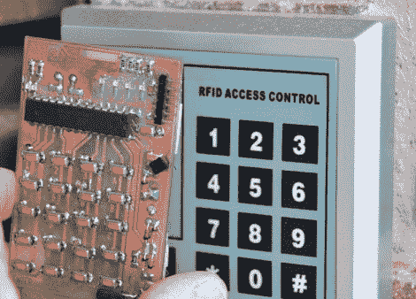

# 带有代码和说明的 RFID 电子欺骗器

> 原文：<https://hackaday.com/2010/11/28/rfid-spoofer-with-code-and-instructions/>

这里有一个由道格·杰克逊开发的现场可编程 RFID 欺骗器。他受到了我们在九月底看到的没有源代码的欺骗者的[启发。有了这个想法，他想他可以开发自己的版本，然后](http://hackaday.com/2010/09/25/rfid-readers-writers-and-spoofers/)[决定和我们其他人分享构建细节](http://www.instructables.com/id/A-Universal-RFID-Key)。

他购买的用于测试和开发欺骗器的标签背面印有代码。对标签阅读器的数据做了一点调查，他成功破解了代码。在那里，他制造了这个带有键盘的标签欺骗器，在键盘上输入任何 125 kHz 标签后面的数字，这个设备就变成了那个标签。如果你一直在等待测试你的 RFID 黑客技术，现在应该没有什么能阻止你了，[道格]分享了他自己的冒险细节。