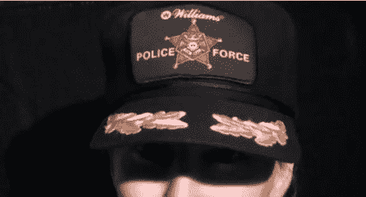

# 雷达枪拆卸

> 原文：<https://hackaday.com/2010/11/28/radar-gun-teardown/>

[Jeri Ellsworth]又来了，这次她[拆开了一个风火轮速度](http://www.youtube.com/watch?v=Dhp21FxttWM) [枪](http://www.youtube.com/watch?v=Dhp21FxttWM) ，在这个过程中她很好地解释了雷达如何被用来测量速度。她还演示了一种方法来确定一个对象是否正在接近或远离雷达枪。

多普勒是一种远程测量物体速度的方法。它的工作原理是测量波撞击物体后频率的变化。大多数雷达枪不是测量回波的多普勒频移，而是使用相移。原因是相对较慢的物体(60 英里/小时)到相对较高频率信号(10 千兆赫)的频移很小(约 0.893 赫兹)，其中相移根据物体的距离而变化。这只是她寻求建造一个简陋的 TSA 人体扫描仪的垫脚石。