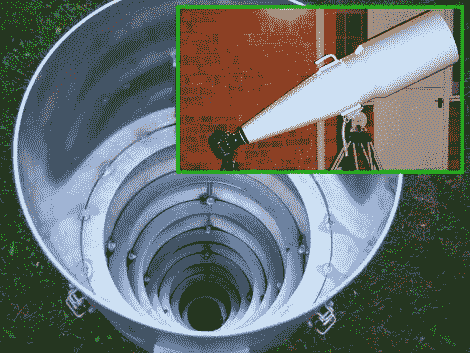

# 你知道他们说戴大镜片的人吗？

> 原文：<https://hackaday.com/2010/12/01/you-know-that-they-say-about-guys-with-big-lenses/>

[托尼·洛弗尔]和[dkpeterborough] [利用飞行模拟器投影仪的光学系统建造了一个相当大的相机镜头](http://www.l-camera-forum.com/leica-forum/customer-forum/66544-home-made-900mm-lens.html)。他们最终得到的是一个 900 毫米的镜头，可以拍摄美丽的月球照片，或捕捉远处的风景细节。镜头的主体是用 CAD 设计的，然后用铝制成，如上图所示。同心挡板有助于防止镜头眩光，但它不能在其裸铝条件下使用。内部使用点画完成涂层，留下砂质纹理。那是用哑光黑色烧烤漆覆盖的，做了很好的防止光学干扰的工作，外面收到了一个有光泽的白色外套。成品重量:59 磅，但一旦你看到这些照片，你就会同意，带着这个笨重的仪器到处去捕捉那致命的一击是值得的。

[通过[使](http://blog.makezine.com/archive/2010/11/large_diy_900mm_lens_is_large.html)