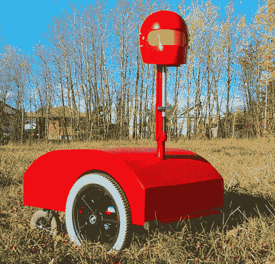

# 下一代机器人 Hijinx

> 原文：<https://hackaday.com/2010/12/03/next-level-robotic-hijinx/>

Oberon 是一种轮式遥控车辆，是[LucidScience]在电动轮椅的基础上建造的。甚至在考虑奥伯龙的潜在用途之前，详细而有用的建造日志就已经足够有价值了:在城镇中昂首阔步，吓唬邻居。

当然，我们以前也见过其他遥控潜水器，但没有一个有同样的*世界之战*“现实入侵”装备。[撞倒不幸的行人](http://hackaday.com/2009/10/24/use-iphone-to-run-yourself-over/)或[在你的敌人身上下地狱](http://hackaday.com/2009/12/30/uav-reigns-down-vengeance-upon-thee/)是伟大的，但一旦你摧毁了周围的人口，你就笑不出来了。奥伯龙就不一样了，有了它，你可以说服疯子先生继续为新机器人帝国的荣耀而疯狂探索。乐趣不止于此——开始崇拜伟大的奥伯龙，享受生活中哈伯德的一面，享受几十年的经济回报和道德堕落……一切都在你自己舒适的客厅里进行！

如果我们能把专业遥控潜水器的能力结合起来推进这个想法，就太棒了，比如这个摄像机器人和白蚁杀手机器人。面对现实吧，谁*不想要一个能说会道、拍照喷药的圣诞化身呢？*